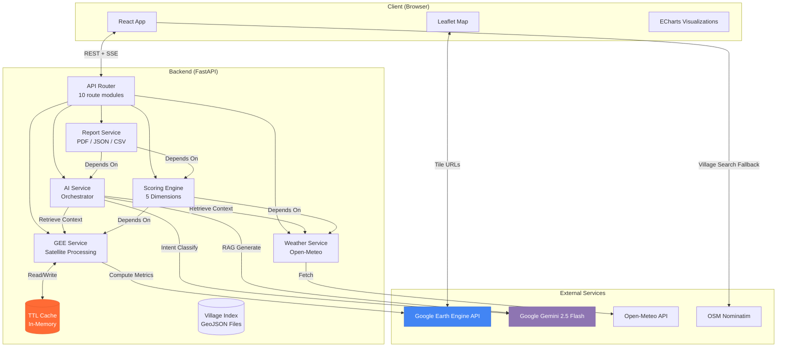
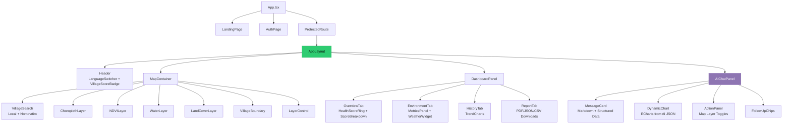
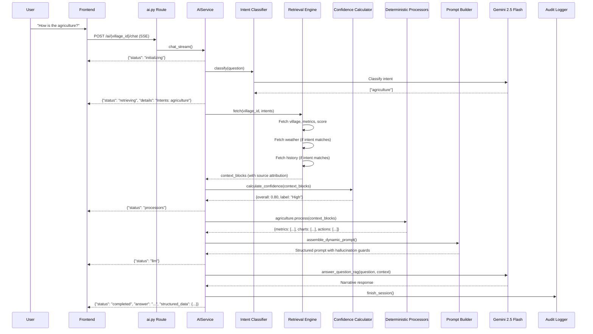
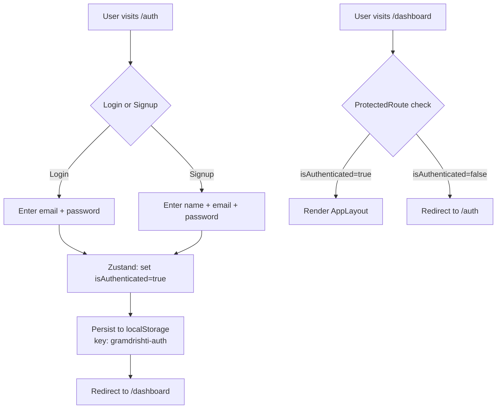
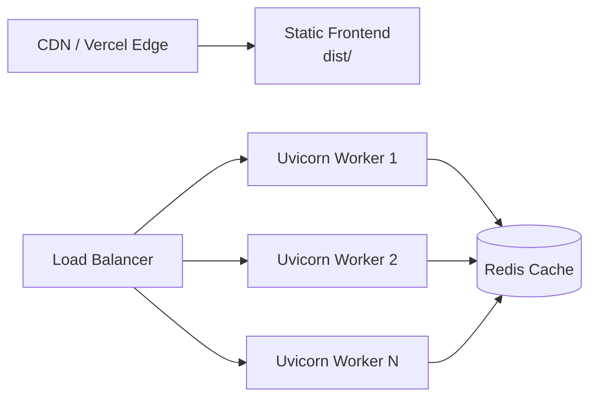

# Architecture — GramDrishti

This document describes the technical architecture of GramDrishti, a Geographic Decision Support System (GDSS) that connects satellite data, weather APIs, and AI into a unified village intelligence platform.

---

## Table of Contents

- [Overall Architecture](#overall-architecture)
- [High-Level System Diagram](#high-level-system-diagram)
- [Frontend Architecture](#frontend-architecture)
- [Backend Architecture](#backend-architecture)
- [AI Pipeline Architecture](#ai-pipeline-architecture)
- [GIS Pipeline](#gis-pipeline)
- [Health Scoring Engine](#health-scoring-engine)
- [Database Design](#database-design)
- [Authentication Flow](#authentication-flow)
- [API Communication](#api-communication)
- [Report Generation Pipeline](#report-generation-pipeline)
- [Deployment Architecture](#deployment-architecture)
- [Security Architecture](#security-architecture)
- [Performance Considerations](#performance-considerations)
- [Design Decisions & Tradeoffs](#design-decisions--tradeoffs)

---

## Overall Architecture

GramDrishti follows a **decoupled client-server architecture** with three distinct layers:

| Layer | Technology | Responsibility |
|---|---|---|
| **Presentation** | React 18 + Vite + TypeScript | Map rendering, dashboard UI, AI chat, report downloads |
| **Application** | FastAPI + Python 3.11 | API routing, GEE orchestration, AI pipeline, scoring, reports |
| **Data** | Google Earth Engine, Open-Meteo, In-Memory Cache | Satellite imagery, weather data, computed metrics |

There is **no traditional database**. All geospatial data is fetched on-demand from external APIs and cached in-memory with TTL expiration. Village boundaries are loaded from local GeoJSON files at startup.

---

## High-Level System Diagram



---

## Frontend Architecture

### Technology Stack
- **React 18.3** with functional components and hooks
- **Vite 8** for bundling and HMR
- **TypeScript 5.9** for type safety
- **Tailwind CSS 3.4** for styling
- **React Router 7** for client-side routing
- **Zustand** for global state management (auth persistence)
- **TanStack Query** for server-state caching and refetching
- **React Leaflet** for interactive map rendering
- **ECharts** for data visualizations (line charts, pie charts, gauge rings)
- **Framer Motion** for animations and transitions
- **i18next** for internationalization (EN, HI, MR)
- **Lucide React** for iconography
- **Axios** for HTTP requests

### Component Architecture



### Key Design Patterns

**1. Context-Based State Management**

The `VillageProvider` (in `useVillageSelection.tsx`) provides shared state to the entire app via React Context:
- `selectedVillage`, `selectedYear` — current selection
- `clickedLocation` — map click coordinates (sent to AI)
- `activeLayers` — currently visible GIS layers (sent to AI)
- `selectedVillagePolygon` — GeoJSON geometry for boundary rendering

**2. Lazy Loading + Code Splitting**

Dashboard tabs (`OverviewTab`, `EnvironmentTab`, `HistoryTab`, `ReportTab`) are loaded via `React.lazy()` and rendered inside `<Suspense>` with skeleton placeholders.

**3. SSE Streaming for AI Chat**

The `useAIChat` hook uses the Fetch API's `ReadableStream` to parse line-delimited JSON from the SSE stream. Pipeline status updates (`initializing`, `retrieving`, `processors`, `llm`) are displayed in real-time before the final response.

**4. Decoupled AI Rendering**

AI responses contain both Markdown narrative text and a `structured_data` JSON payload. The frontend's `MessageCard` renders the Markdown, while `DynamicChart` and `ActionPanel` parse the structured JSON to render native ECharts charts and map-interaction buttons.

---

## Backend Architecture

### Technology Stack
- **FastAPI** with Uvicorn (ASGI)
- **Python 3.11** with `async/await`
- **Pydantic v2** for request/response validation
- **pydantic-settings** for environment configuration
- **httpx** for async HTTP calls (Gemini, Open-Meteo, Ollama)
- **GeoPandas + Shapely** for GeoJSON processing
- **Rasterio** for raster data handling
- **Earth Engine API** for satellite data
- **ReportLab + Pillow** for PDF generation

### Route Architecture

All routes are mounted under `/api/v1/` from `main.py`:

| Route Module | Prefix | Endpoints | Purpose |
|---|---|---|---|
| `health.py` | `/health` | `GET /` | Health check |
| `villages.py` | `/villages` | `GET /search`, `GET /{id}`, `GET /{id}/boundary`, `POST /register`, `GET /boundaries/all` | Village CRUD + dynamic registration |
| `satellite.py` | `/satellite` | `GET /{id}/metrics`, `GET /{id}/ndvi`, `GET /{id}/water`, `GET /{id}/landcover`, `GET|POST /{id}/*/tiles`, `GET /regions/metrics` | GEE satellite data + tile URLs |
| `weather.py` | `/weather` | Weather endpoints | Open-Meteo data |
| `scores.py` | `/scores` | `GET /{id}` | 5-dimension health scores |
| `history.py` | `/history` | `GET /{id}` | Multi-year historical data |
| `analysis.py` | `/analysis` | Analysis endpoints | Climate assessment + change detection |
| `ai.py` | `/ai` | `POST /{id}/chat`, `POST /{id}/summary`, `POST /{id}/recommendations`, `GET /{id}/report-narrative` | AI services (SSE + REST) |
| `recommendations.py` | `/recommendations` | `GET /{id}` | Proactive insights |
| `reports.py` | `/reports` | `GET /{id}/pdf`, `GET /{id}/json`, `GET /{id}/csv` | Report downloads |

### Startup Lifecycle


---

## AI Pipeline Architecture

The AI pipeline is the core innovation. It uses an **Agentic Deterministic Processor** pattern rather than dumping raw data into an LLM.

### Pipeline Sequence



### Component Responsibilities

| Component | File | What It Does | What It Doesn't Do |
|---|---|---|---|
| **Intent Classifier** | `classifier.py` | Routes queries to domain processors using Gemini + keyword fallback | Doesn't generate any user-facing content |
| **Retrieval Engine** | `retrieval_engine.py` | Fetches only the data relevant to classified intents, with source tags | Doesn't process or interpret data |
| **Confidence Calculator** | `confidence.py` | Scores data availability: `0.35×GIS + 0.25×Weather + 0.20×History + 0.20×Predictions` | Doesn't affect what data is fetched |
| **Processors** | `processors/*.py` | Deterministically computes metrics, charts, actions, and threshold-based recommendations | Never calls an LLM |
| **Prompt Builder** | `prompt_builder.py` | Assembles structured JSON + hallucination guards + language instructions into a system prompt | Doesn't generate the response |
| **Gemini Client** | `gemini_client.py` | Calls Gemini 2.5 Flash API with timeout handling and fallback responses | Only generates narrative text |
| **Audit Logger** | `audit.py` | Logs every query with: intents, datasets, processors, JSON size, confidence, execution time | Doesn't affect pipeline behavior |

### Supported Intents

| Intent | Processor | Retrieves | Outputs |
|---|---|---|---|
| `agriculture` | `agriculture.py` | GEE metrics, historical NDVI | NDVI metric card, trend chart, toggle_layer action |
| `water` | `water.py` | GEE metrics, weather, historical NDWI | NDWI metric, rainfall metric, trend chart, toggle_layer |
| `disaster` | `disaster.py` | Weather, health scores | Flood risk assessment, toggle flood zone layer |
| `general` | All processors | All datasets | Combined output from agriculture + water + disaster |
| `schemes` | `schemes.py` | GEE metrics, weather | Matched government schemes (PMKSY, Soil Health Card, etc.) |

---

## GIS Pipeline

### Data Sources

| Dataset | Source | Resolution | Metrics Extracted |
|---|---|---|---|
| **Sentinel-2** | `COPERNICUS/S2_SR_HARMONIZED` | 10m | NDVI, NDWI, Red, NIR, SWIR |
| **Dynamic World** | `GOOGLE/DYNAMICWORLD/V1` | 10m | Land cover classification (9 classes) |
| **SRTM DEM** | `USGS/SRTMGL1_003` | 30m | Elevation, Slope, Flood risk area |
| **JRC Water** | `JRC/GSW1_4/GlobalSurfaceWater` | 30m | Water area, seasonal water, occurrence |

### Tile Generation Flow

```mermaid
flowchart LR
    A[Frontend requests tile URL] --> B[Backend route]
    B --> C[asyncio.to_thread]
    C --> D[GEE compute on Google servers]
    D --> E[getMapId → Tile URL template]
    E --> F[Return {urlFormat, bounds}]
    F --> G[Leaflet TileLayer renders tiles]
```

The backend generates **GEE tile URLs** (not raw images) — the browser fetches tiles directly from Google's tile servers, keeping the backend lightweight.

### Mock Data System

For demo/offline use, `processor.py` contains `MOCK_METRICS` — a dictionary of deterministic data for 5 villages × 5 years. When `USE_MOCK_DATA=true` or GEE is unavailable, the system returns this data with `dataSource: "mock"`.

---

## Health Scoring Engine

### Scoring Formula

Each dimension is scored 0–100, then combined using weighted average:

```
Overall = (0.25 × Water) + (0.25 × Vegetation) + (0.20 × Climate) + (0.15 × Flood) + (0.15 × Land)
```

### Dimension Formulas

| Dimension | Components | Formula |
|---|---|---|
| **Water Security** | Water coverage + NDWI + Rainfall | `min(waterAreaHa/(area×100)×500, 40) + min((ndwi+1)/2×100, 30) + min(rainfall/800×30, 30)` |
| **Vegetation Health** | NDVI + Green cover + Tree cover | `min(ndvi×100, 50) + min(greenCover/60×30, 30) + min(trees/30×20, 20)` |
| **Climate Stability** | Base 100, minus penalties | `100 - tempPenalty - rainfallDeficit - heatStress - droughtRisk` |
| **Flood Preparedness** | Base 100, minus penalties | `100 - floodAreaPenalty - floodedLandPenalty - flatRainfallPenalty` |
| **Land Sustainability** | Base 100, minus penalties | `100 - bareLandPenalty - builtAreaPenalty - degradationPenalty` |

### Trend Detection

```python
delta = current_score - previous_year_score
if delta > 2.0: "improving"
elif delta < -2.0: "declining"
else: "stable"
```

---

## Database Design

GramDrishti uses **no traditional database**. Data storage is handled through:

| Store | Type | Lifetime | Contents |
|---|---|---|---|
| `SEARCH_CACHE` | Python dict | Server process | `{village_id: Village}` — Pydantic models |
| `BOUNDARY_CACHE` | Python dict | Server process | `{village_id: GeoJSON geometry}` |
| `SEARCH_INDEX` | Python list | Server process | `[{id, name, district, state}]` — searchable metadata |
| `TTLCache` | Python dict with TTL | Configurable (default 24h) | `{cache_key: {value, expires_at}}` — GEE metrics, AI responses |
| `data/*.geojson` | GeoJSON files | Persistent | Pre-loaded village boundaries (Maharashtra) |
| `logs/ai_audits/*.jsonl` | JSONL files | Persistent | AI pipeline audit trail |

---

## Authentication Flow

Authentication is **client-side only** using Zustand with `persist` middleware:



> **Note:** There is no server-side authentication. This is a client-side session suitable for a hackathon demo. See [FUTURE_SCOPE.md](FUTURE_SCOPE.md) for planned authentication improvements.

---

## API Communication

### REST Endpoints

Standard request-response for data fetching:
- Village search, metrics, scores, weather, history, recommendations
- Report downloads (PDF/JSON/CSV)

### Server-Sent Events (SSE)

The AI chat endpoint (`POST /ai/{village_id}/chat`) uses `StreamingResponse` with `text/event-stream` media type. The response is a sequence of newline-delimited JSON objects:

```
{"status": "initializing"}
{"status": "retrieving", "details": "Intents: agriculture"}
{"status": "processors"}
{"status": "llm"}
{"status": "completed", "answer": "...", "structured_data": {...}, "follow_up_questions": [...]}
```

The frontend reads this with `ReadableStream` + `TextDecoder`, displaying pipeline status indicators in real-time.

### Request Payload Example (AI Chat)

```json
{
  "question": "How is the agriculture?",
  "language": "en",
  "history": [{"id": "1", "role": "user", "content": "Previous question"}],
  "mapState": {"visibleLayers": ["ndvi", "boundary"]},
  "clickedLocation": {"lat": 18.52, "lng": 73.53}
}
```

The AI receives the user's visible map layers and clicked location as context, enabling spatially-aware responses.

---

## Report Generation Pipeline

```mermaid
flowchart TD
    A[User clicks Download PDF] --> B[Frontend: report.service.ts]
    B --> C[GET /api/v1/reports/{id}/pdf?year=2024&include_ai=true]
    C --> D[Fetch village + metrics + scores]
    D --> E[Fetch AI recommendations]
    D --> F[Fetch AI narrative]
    E --> G[VillageReportGenerator.generate_pdf]
    F --> G
    G --> H[ReportLab builds A4 PDF]
    H --> I[Cover page + Executive Summary]
    H --> J[Health Score Table]
    H --> K[Environmental Metrics Table]
    H --> L[Priority Recommendations]
    H --> M[Data Sources & Methodology]
    I --> N[Return PDF bytes as attachment]
    J --> N
    K --> N
    L --> N
    M --> N
```

Reports are generated **on-demand** — no pre-computation or storage required.

---

## Deployment Architecture

### Current (Development)

```
Frontend: npm run dev → Vite dev server on :5173
Backend:  uvicorn main:app --reload → FastAPI on :8000
```

### Production (Vercel)

Both frontend and backend include `vercel.json` configs:

- **Frontend**: Standard Vite static build (`npm run build → dist/`)
- **Backend**: Python serverless function with 60-second max duration

### Alternative Production Stack



---

## Security Architecture

| Layer | Mechanism | Implementation |
|---|---|---|
| **CORS** | Configurable allowed origins | `CORSMiddleware` with `ALLOWED_ORIGINS` env var |
| **Rate Limiting** | 10 requests/minute per IP on AI endpoints | Manual implementation in `ai.py` using TTL cache |
| **Input Validation** | Pydantic models on all endpoints | Request body validation, query parameter constraints |
| **GEE Credentials** | Service account JSON, gitignored | `backend/credentials/` directory in `.gitignore` |
| **API Keys** | Environment variables, not hardcoded | `.env` files excluded from git |
| **AI Safety** | Hallucination guards in system prompt | Structured context + explicit "unavailable" fallback |
| **Error Handling** | Custom exceptions + HTTP error codes | `GEETimeoutError` (504), `GEEDataError` (422), standard 404/429/500 |

---

## Performance Considerations

| Concern | Current Approach | Impact |
|---|---|---|
| **GEE Latency** | In-memory TTL cache (24h default) | First load ~45s, subsequent <2s |
| **AI Response Time** | SSE streaming with status updates | User sees progress; perceived wait is shorter |
| **Frontend Bundle** | Lazy-loaded tabs, code splitting | Initial load only includes map + shell |
| **Map Tiles** | Browser fetches directly from GEE tile servers | Backend serves only tile URLs, not pixel data |
| **Village Search** | In-memory linear search on SEARCH_INDEX | Fast for <1000 villages; needs indexing at scale |
| **Report Generation** | Synchronous PDF build per request | Adequate for low concurrency; needs queue at scale |

---

## Design Decisions & Tradeoffs

| Decision | Rationale | Tradeoff |
|---|---|---|
| **No database** | Eliminates setup complexity for hackathon; all data is on-demand from APIs | Cache lost on restart; no persistent user data |
| **In-memory cache** | Zero infrastructure dependency; works in serverless | Not shared across workers; limited by process memory |
| **Deterministic processors over LLM** | Guarantees accurate numbers and charts; LLM only handles narrative | More code to maintain; adding a new domain requires a new processor |
| **Gemini for intent classification** | More accurate than keyword matching for ambiguous queries | Adds an API call; keyword fallback ensures resilience |
| **Client-side auth only** | No backend auth simplifies architecture for demo | Not suitable for production; any user can access all data |
| **SSE instead of WebSocket** | Simpler to implement; one-directional data flow matches the use case | No server push for non-chat events |
| **GeoJSON files instead of PostGIS** | No database setup required; works offline | Doesn't scale beyond a few hundred pre-loaded villages |
| **Mock data fallback** | Full app demo without any API credentials | Mock data doesn't reflect real satellite conditions |

---

*For workflow diagrams, see [PROJECT_WORKFLOW.md](PROJECT_WORKFLOW.md). For scaling plans, see [FUTURE_SCOPE.md](FUTURE_SCOPE.md).*
