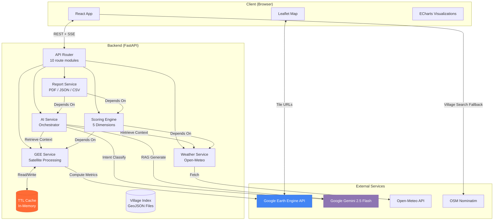
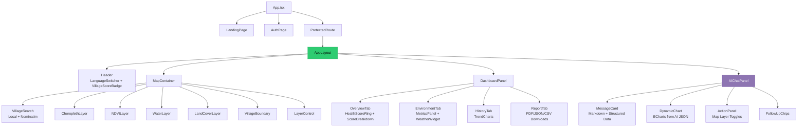
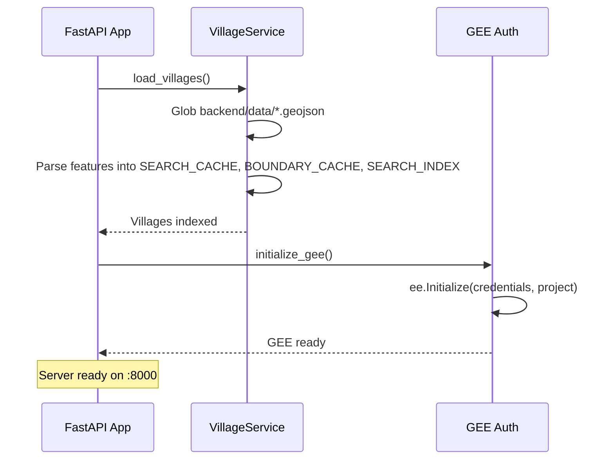
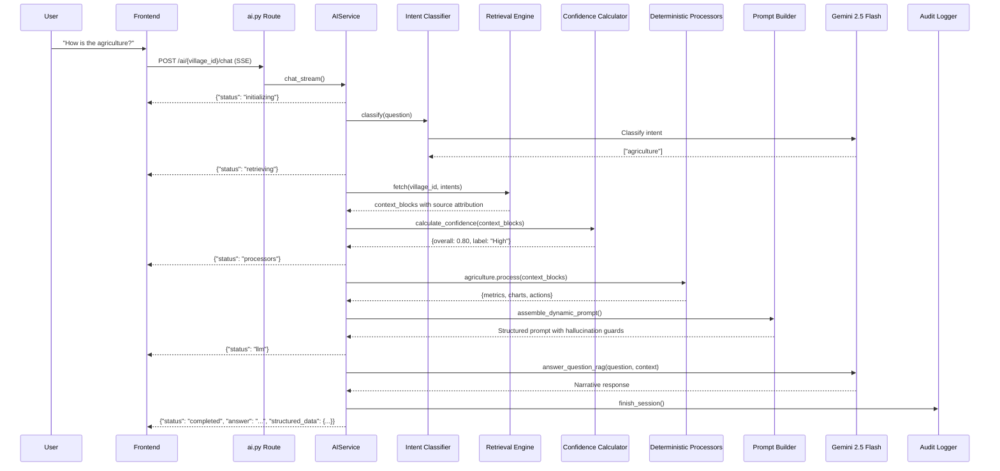
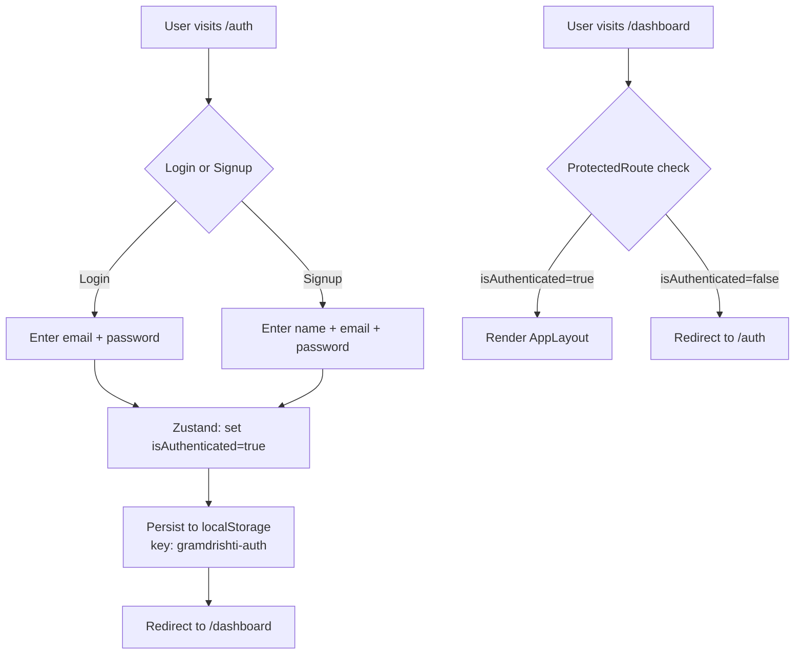
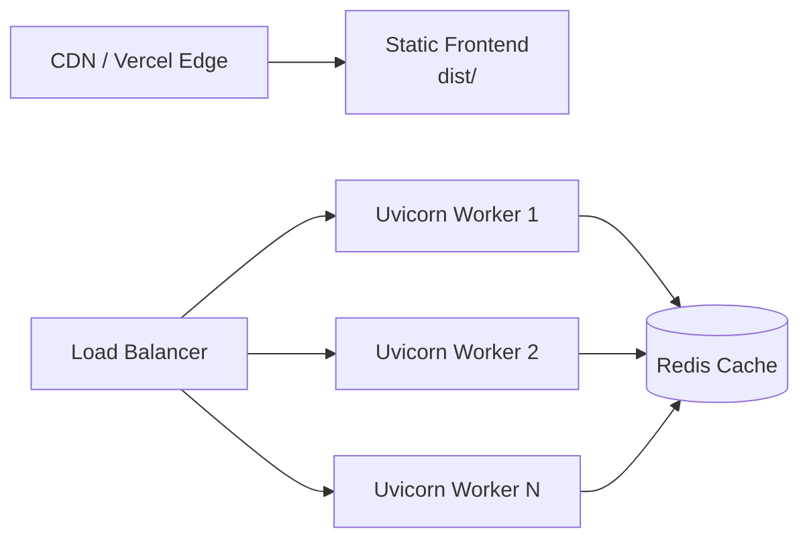

# Architecture — GramDrishti

This document describes the technical architecture of GramDrishti, a Geographic Decision Support System (GDSS) that connects satellite data, weather APIs, and AI into a unified village intelligence platform.

---

## Table of Contents

- [Overall Architecture](#overall-architecture)
- [High-Level System Diagram](#high-level-system-diagram)
- [Frontend Architecture](#frontend-architecture)
- [Backend Architecture](#backend-architecture)
- [AI Pipeline Architecture](#ai-pipeline-architecture)
- [GIS Pipeline](#gis-pipeline)
- [Health Scoring Engine](#health-scoring-engine)
- [Database Design](#database-design)
- [Authentication Flow](#authentication-flow)
- [API Communication](#api-communication)
- [Report Generation Pipeline](#report-generation-pipeline)
- [Deployment Architecture](#deployment-architecture)
- [Security Architecture](#security-architecture)
- [Performance Considerations](#performance-considerations)
- [Design Decisions and Tradeoffs](#design-decisions-and-tradeoffs)

---

## Overall Architecture

GramDrishti follows a **decoupled client-server architecture** with three distinct layers:

| Layer | Technology | Responsibility |
|---|---|---|
| Presentation | React 18 + Vite + TypeScript | Map rendering, dashboard UI, AI chat, report downloads |
| Application | FastAPI + Python 3.11 | API routing, GEE orchestration, AI pipeline, scoring, reports |
| Data | Google Earth Engine, Open-Meteo, In-Memory Cache | Satellite imagery, weather data, computed metrics |

There is **no traditional database**. All geospatial data is fetched on-demand from external APIs and cached in-memory with TTL expiration. Village boundaries are loaded from local GeoJSON files at startup.

---

## High-Level System Diagram



---

## Frontend Architecture

### Technology Stack
- **React 18.3** with functional components and hooks
- **Vite 8** for bundling and HMR
- **TypeScript 5.9** for type safety
- **Tailwind CSS 3.4** for styling
- **React Router 7** for client-side routing
- **Zustand** for global state management (auth persistence)
- **TanStack Query** for server-state caching and refetching
- **React Leaflet** for interactive map rendering
- **ECharts** for data visualizations (line charts, pie charts, gauge rings)
- **Framer Motion** for animations and transitions
- **i18next** for internationalization (EN, HI, MR)
- **Lucide React** for iconography
- **Axios** for HTTP requests

### Component Architecture



### Key Design Patterns

**Context-Based State Management**

The `VillageProvider` (in `useVillageSelection.tsx`) provides shared state to the entire app via React Context:
- `selectedVillage`, `selectedYear` — current selection
- `clickedLocation` — map click coordinates (sent to AI)
- `activeLayers` — currently visible GIS layers (sent to AI)
- `selectedVillagePolygon` — GeoJSON geometry for boundary rendering

**Lazy Loading and Code Splitting**

Dashboard tabs (`OverviewTab`, `EnvironmentTab`, `HistoryTab`, `ReportTab`) are loaded via `React.lazy()` and rendered inside `<Suspense>` with skeleton placeholders.

**SSE Streaming for AI Chat**

The `useAIChat` hook uses the Fetch API's `ReadableStream` to parse line-delimited JSON from the SSE stream. Pipeline status updates are displayed in real-time before the final response arrives.

**Decoupled AI Rendering**

AI responses contain both Markdown narrative text and a `structured_data` JSON payload. The frontend's `MessageCard` renders the Markdown, while `DynamicChart` and `ActionPanel` parse the structured JSON to render ECharts visualizations and map-interaction buttons.

---

## Backend Architecture

### Technology Stack
- **FastAPI** with Uvicorn (ASGI)
- **Python 3.11** with `async/await`
- **Pydantic v2** for request/response validation
- **pydantic-settings** for environment configuration
- **httpx** for async HTTP calls (Gemini, Open-Meteo, Ollama)
- **GeoPandas + Shapely** for GeoJSON processing
- **Rasterio** for raster data handling
- **Earth Engine API** for satellite data
- **ReportLab + Pillow** for PDF generation

### Route Architecture

All routes are mounted under `/api/v1/` from `main.py`:

| Route Module | Prefix | Purpose |
|---|---|---|
| `health.py` | `/health` | Health check endpoint |
| `villages.py` | `/villages` | Search, CRUD, dynamic registration, boundaries |
| `satellite.py` | `/satellite` | GEE metrics, NDVI, water, land cover, tile URLs |
| `weather.py` | `/weather` | Open-Meteo current and historical data |
| `scores.py` | `/scores` | 5-dimension health scores |
| `history.py` | `/history` | Multi-year historical data |
| `analysis.py` | `/analysis` | Climate assessment, change detection |
| `ai.py` | `/ai` | Chat (SSE), summary, recommendations, report narrative |
| `recommendations.py` | `/recommendations` | Proactive AI-generated insights |
| `reports.py` | `/reports` | PDF, JSON, CSV downloads |

### Startup Lifecycle



---

## AI Pipeline Architecture

The AI pipeline uses an **Agentic Deterministic Processor** pattern. Computation is separated from narration.

### Pipeline Sequence



### Component Responsibilities

| Component | File | Responsibility | What It Does Not Do |
|---|---|---|---|
| Intent Classifier | `classifier.py` | Route queries to processors using Gemini + keyword fallback | Does not generate user-facing content |
| Retrieval Engine | `retrieval_engine.py` | Fetch only data relevant to classified intents, with source tags | Does not interpret data |
| Confidence Calculator | `confidence.py` | Score data availability: `0.35xGIS + 0.25xWeather + 0.20xHistory + 0.20xPredictions` | Does not affect what data is fetched |
| Processors | `processors/*.py` | Deterministically compute metrics, charts, actions, and recommendations | Never calls an LLM |
| Prompt Builder | `prompt_builder.py` | Assemble structured JSON context + hallucination guards + language instructions | Does not generate the response |
| Gemini Client | `gemini_client.py` | Call Gemini 2.5 Flash with timeout handling and fallback responses | Only generates narrative text |
| Audit Logger | `audit.py` | Log every query with intents, datasets, processors, JSON size, confidence, execution time | Does not affect pipeline behavior |

### Supported Intents

| Intent | Processor | Data Retrieved | Output |
|---|---|---|---|
| `agriculture` | `agriculture.py` | GEE metrics, historical NDVI | NDVI metric card, trend chart, toggle_layer action |
| `water` | `water.py` | GEE metrics, weather, historical NDWI | NDWI and rainfall metrics, trend chart |
| `disaster` | `disaster.py` | Weather, health scores | Flood risk assessment, terrain analysis |
| `general` | All processors | All datasets | Combined output from all processors |
| `schemes` | `schemes.py` | GEE metrics, weather | Matched government schemes |

---

## GIS Pipeline

### Data Sources

| Dataset | Source | Resolution | Metrics Extracted |
|---|---|---|---|
| Sentinel-2 | `COPERNICUS/S2_SR_HARMONIZED` | 10m | NDVI, NDWI, Red, NIR, SWIR |
| Dynamic World | `GOOGLE/DYNAMICWORLD/V1` | 10m | Land cover classification (9 classes) |
| SRTM DEM | `USGS/SRTMGL1_003` | 30m | Elevation, slope, flood risk area |
| JRC Water | `JRC/GSW1_4/GlobalSurfaceWater` | 30m | Water area, seasonal water, occurrence |

### Tile Generation Flow


The backend generates GEE tile URLs — not raw images. The browser fetches tiles directly from Google's tile servers, keeping the backend lightweight.

### Mock Data System

For demo and offline use, `processor.py` contains `MOCK_METRICS` — deterministic data for 5 villages across 5 years. When `USE_MOCK_DATA=true` or GEE is unavailable, the system returns this data with `dataSource: "mock"`.

---

## Health Scoring Engine

### Scoring Formula

Each dimension is scored 0–100, then combined using a weighted average:

```
Overall = (0.25 x Water) + (0.25 x Vegetation) + (0.20 x Climate) + (0.15 x Flood) + (0.15 x Land)
```

### Dimension Formulas

| Dimension | Components | Formula Basis |
|---|---|---|
| Water Security | Water coverage + NDWI + Rainfall | Surface water area, NDWI index, annual rainfall |
| Vegetation Health | NDVI + Green cover + Tree cover | NDVI magnitude, green cover percent, tree cover percent |
| Climate Stability | Base 100 minus penalties | Temperature anomaly, rainfall deficit, heat stress, drought risk |
| Flood Preparedness | Base 100 minus penalties | Flood area ratio, flooded land percent, flat terrain with high rainfall |
| Land Sustainability | Base 100 minus penalties | Bare land percent, built area expansion, land degradation indicators |

### Trend Detection

```python
delta = current_score - previous_year_score
if delta > 2.0:   "improving"
elif delta < -2.0: "declining"
else:              "stable"
```

---

## Database Design

GramDrishti uses no traditional database. Storage is handled through:

| Store | Type | Lifetime | Contents |
|---|---|---|---|
| `SEARCH_CACHE` | Python dict | Server process | `{village_id: Village}` — Pydantic models |
| `BOUNDARY_CACHE` | Python dict | Server process | `{village_id: GeoJSON geometry}` |
| `SEARCH_INDEX` | Python list | Server process | Searchable metadata: id, name, district, state |
| `TTLCache` | Python dict with TTL | Configurable (default 24h) | GEE metrics, AI responses |
| `data/*.geojson` | GeoJSON files | Persistent on disk | Pre-loaded village boundaries (Maharashtra) |
| `logs/ai_audits/*.jsonl` | JSONL files | Persistent on disk | AI pipeline audit trail |

---

## Authentication Flow

Authentication is client-side only, using Zustand with `persist` middleware:



> There is no server-side authentication. This is a client-side session suitable for hackathon demo use. See [FUTURE_SCOPE.md](FUTURE_SCOPE.md) for planned improvements.

---

## API Communication

### REST Endpoints

Standard request-response for data fetching: village search, metrics, scores, weather, history, recommendations, report downloads.

### Server-Sent Events (SSE)

The AI chat endpoint (`POST /ai/{village_id}/chat`) uses `StreamingResponse` with `text/event-stream`. The response is a sequence of newline-delimited JSON objects:

```
{"status": "initializing"}
{"status": "retrieving", "details": "Intents: agriculture"}
{"status": "processors"}
{"status": "llm"}
{"status": "completed", "answer": "...", "structured_data": {...}, "follow_up_questions": [...]}
```

The frontend reads this with `ReadableStream` + `TextDecoder`, displaying status indicators in real-time.

### AI Chat Request Payload

```json
{
  "question": "How is the agriculture?",
  "language": "en",
  "history": [{"id": "1", "role": "user", "content": "..."}],
  "mapState": {"visibleLayers": ["ndvi", "boundary"]},
  "clickedLocation": {"lat": 18.52, "lng": 73.53}
}
```

The AI receives the user's active map layers and clicked location as context, enabling spatially-aware responses.

---

## Report Generation Pipeline

```mermaid
flowchart TD
    A[User clicks Download PDF] --> B[Frontend: report.service.ts]
    B --> C[GET /api/v1/reports/{id}/pdf?year=2024&include_ai=true]
    C --> D[Fetch village + metrics + scores]
    D --> E[Fetch AI recommendations]
    D --> F[Fetch AI narrative]
    E --> G[VillageReportGenerator.generate_pdf]
    F --> G
    G --> H[ReportLab builds A4 PDF]
    H --> I[Cover page + Executive Summary]
    H --> J[Health Score Table]
    H --> K[Environmental Metrics Table]
    H --> L[Priority Recommendations]
    H --> M[Data Sources and Methodology]
    I --> N[Return PDF bytes as attachment]
    J --> N
    K --> N
    L --> N
    M --> N
```

Reports are generated on-demand — no pre-computation or storage required.

---

## Deployment Architecture

### Development

```
Frontend: npm run dev  -->  Vite dev server on :5173
Backend:  uvicorn main:app --reload  -->  FastAPI on :8000
```

### Production (Vercel)

Both frontend and backend include `vercel.json` configs:
- **Frontend:** Vite static build (`npm run build` → `dist/`)
- **Backend:** Python serverless function, 60-second max duration, Python 3.11 runtime

### Alternative Production Stack



---

## Security Architecture

| Layer | Mechanism | Implementation |
|---|---|---|
| CORS | Configurable allowed origins | `CORSMiddleware` with `ALLOWED_ORIGINS` env var |
| Rate Limiting | 10 requests/minute per IP on AI endpoints | TTL cache-based counter in `ai.py` |
| Input Validation | Pydantic models on all endpoints | Request body and query parameter validation |
| GEE Credentials | Service account JSON, gitignored | `backend/credentials/` excluded from git |
| API Keys | Environment variables only | `.env` files excluded from git |
| AI Safety | Hallucination guards in system prompt | Structured context + explicit unavailable fallback |
| Error Handling | Custom exception types with HTTP codes | `GEETimeoutError` (504), `GEEDataError` (422), 404/429/500 |

---

## Performance Considerations

| Concern | Current Approach | Impact |
|---|---|---|
| GEE Latency | In-memory TTL cache (24h) | First load ~45s; subsequent requests <2s |
| AI Response Time | SSE streaming with pipeline status updates | User sees progress; perceived wait is shorter |
| Frontend Bundle | Lazy-loaded tabs, Vite code splitting | Initial load includes only map and shell |
| Map Tiles | Browser fetches directly from GEE tile servers | Backend serves only tile URLs, not pixel data |
| Village Search | In-memory linear scan of SEARCH_INDEX | Fast for <1000 villages; needs indexing at scale |
| Report Generation | Synchronous PDF build per request | Adequate for low concurrency; needs queue at scale |

---

## Design Decisions and Tradeoffs

| Decision | Rationale | Tradeoff |
|---|---|---|
| No database | Eliminates setup complexity; all data fetched on-demand | Cache lost on restart; no persistent user data |
| In-memory cache | Zero infrastructure dependency; works in serverless | Not shared across workers; limited by process memory |
| Deterministic processors over LLM | Guarantees accurate numbers and charts | More code to maintain; adding a domain requires a new processor |
| Gemini for intent classification | More accurate than keyword matching for ambiguous queries | Adds an API call; keyword fallback provides resilience |
| Client-side auth only | No backend auth simplifies the demo architecture | Not suitable for production |
| SSE instead of WebSocket | Simpler to implement; matches one-directional use case | No server push for non-chat events |
| GeoJSON files instead of PostGIS | No database setup required; works offline | Does not scale beyond a few hundred pre-loaded villages |
| Mock data fallback | Full demo without any API credentials | Mock data does not reflect real satellite conditions |

---

*For workflow diagrams, see [PROJECT_WORKFLOW.md](PROJECT_WORKFLOW.md). For scaling plans, see [FUTURE_SCOPE.md](FUTURE_SCOPE.md).*
