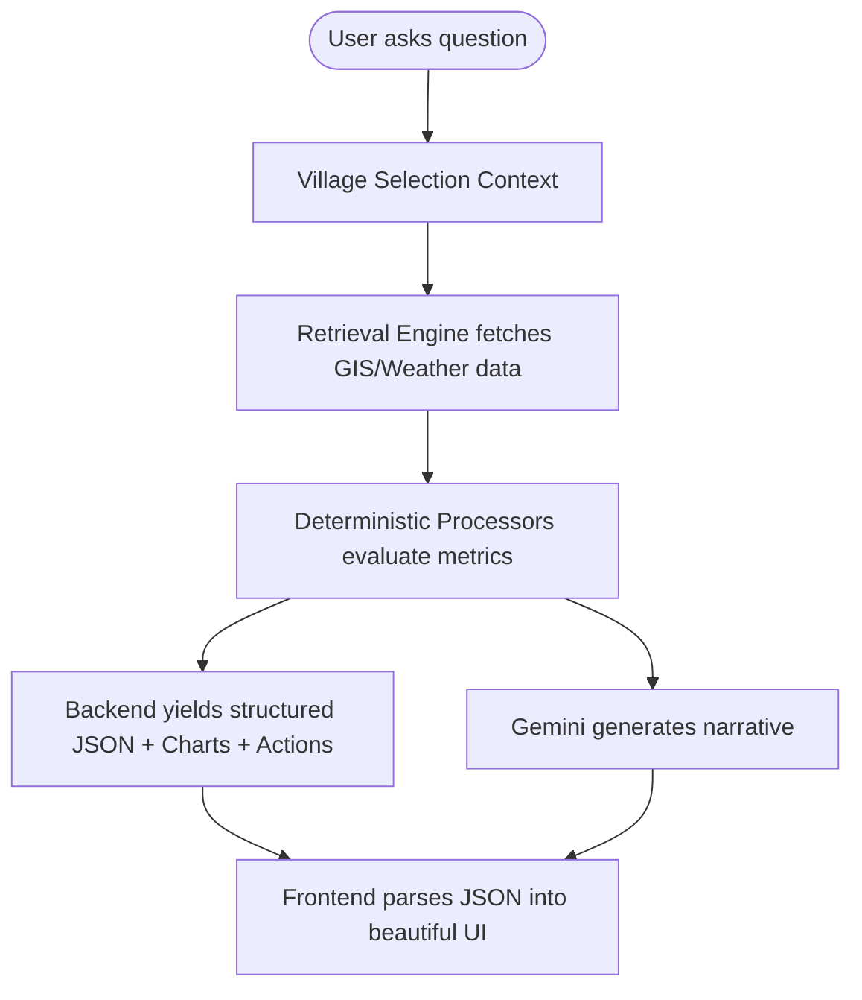

# GramDrishti: Technical Documentation

Welcome to the comprehensive technical documentation for **GramDrishti**—a Geographic Decision Support System (GDSS) powered by real-time satellite data and deterministic Retrieval-Augmented Generation (RAG) AI.

This document is designed for open-source contributors, hackathon judges, and future developers.

---

## 1. System Architecture

GramDrishti uses a modern, decoupled architecture designed for heavy GIS and AI processing.

### High-Level Architecture
- **Frontend**: React 18, Vite, TypeScript, Tailwind CSS, Leaflet (React-Leaflet), and ECharts.
- **Backend**: FastAPI (Python), Uvicorn, GeoPandas, Rasterio, and Google Earth Engine APIs.
- **AI Engine**: Google Gemini (via `google-generativeai`) wrapped in a custom deterministic processor pipeline.

### Frontend Architecture
The frontend is built for extreme responsiveness. It completely decouples UI rendering from LLM text generation. The AI responds with Markdown for narrative text and structured JSON for UI rendering (e.g., charts, metrics, buttons), which the frontend parses using native components (`MessageCard.tsx`, `DynamicChart.tsx`, `ActionPanel.tsx`).

### Backend Architecture
The backend is fundamentally stateless, retrieving data on the fly. It utilizes Python's asynchronous capabilities (`asyncio`) and Server-Sent Events (SSE) via `StreamingResponse` to push pipeline updates in real-time.

### AI & RAG Pipeline
Instead of blindly injecting data into an LLM context window, GramDrishti uses an **Agentic Deterministic Processor** architecture:
1.  **Intent Classification**: Identifies the user's intent (e.g., "Agriculture", "Water").
2.  **Retrieval Engine**: Fetches modular context only relevant to the intent.
3.  **Processors**: Python scripts that deterministically calculate metrics, charts, and actions based on the retrieved data.
4.  **Generative AI**: Gemini interprets the processor output to formulate a narrative.

### GIS Pipeline
GIS boundaries are loaded locally or dynamically fetched via Nominatim. The maps use Leaflet to render interactive GeoJSON choropleth polygons and dynamic tile overlays.

---

## 2. Folder Structure

```text
GramDrishti/
├── frontend/                     # React + Vite Frontend
│   ├── public/demo/              # Fallback JSON scenarios for hackathon presentations
│   ├── src/
│   │   ├── components/
│   │   │   ├── ai/               # Chat UI, MessageCard, DynamicChart, ActionPanel
│   │   │   ├── dashboard/        # InsightsPanel, ScoreBreakdown
│   │   │   ├── map/              # Leaflet integration, ChoroplethLayer, NDVILayer
│   │   │   └── layout/           # AppLayout, Sidebar
│   │   ├── hooks/                # useAIChat (SSE streaming), useVillageSelection
│   │   └── services/             # Axios API services
├── backend/                      # FastAPI Backend
│   ├── app/
│   │   ├── api/routes/           # API Endpoints (ai.py, maps.py, reports.py)
│   │   ├── services/
│   │   │   ├── ai/
│   │   │   │   ├── processors/   # agriculture.py, water.py, disaster.py, schemes.py
│   │   │   │   ├── ai_service.py # Core streaming orchestrator
│   │   │   │   ├── retrieval_engine.py
│   │   │   │   └── prompt_builder.py
│   │   │   └── village_service.py# GeoPandas boundary loading
│   ├── tests/                    # Pytest suite
│   └── requirements.txt
└── DOCUMENTATION.md              # You are here
```

---

## 3. Data Flow

The core workflow of GramDrishti guarantees highly contextual, hallucination-free AI responses:



---

## 4. API Documentation

### `POST /api/v1/ai/{village_id}/chat`
Streams the AI response using Server-Sent Events (SSE).

**Request Body:**
```json
{
  "question": "How is the agriculture?",
  "language": "en",
  "history": [],
  "mapState": {},
  "clickedLocation": null
}
```

**Response (SSE Stream Chunks):**
```json
{"status": "initializing"}
{"status": "retrieving", "details": "Intents: agriculture"}
{"status": "processors"}
{"status": "llm"}
{
  "status": "completed",
  "answer": "The agriculture is improving...",
  "structured_data": {
    "retrieved_data": {...},
    "processor_insights": {
      "agriculture": {
        "metrics": [{"name": "NDVI", "value": 0.61, "unit": ""}],
        "charts": [{"type": "line", "title": "NDVI Trend", "x": [2024], "y": [0.61]}],
        "actions": [{"type": "toggle_layer", "layer": "ndvi"}]
      }
    }
  },
  "follow_up_questions": ["Show drought risk"]
}
```

### `POST /api/v1/ai/{village_id}/recommendations`
Fetches proactive insights for the `InsightsPanel`. Returns top recommendations and a health score.

---

## 5. Deployment Guide

### Environment Variables
**Backend (`backend/.env`):**
```env
GEMINI_API_KEY=your_google_api_key
EARTHENGINE_TOKEN=your_gee_token
```

### Production Build
**Frontend:**
```bash
cd frontend
npm install
npm run build
```
This generates the optimized bundle in `frontend/dist/`. Serve using NGINX, Vercel, or simply serve static files from FastAPI.

**Backend:**
```bash
cd backend
pip install -r requirements.txt
uvicorn app.main:app --host 0.0.0.0 --port 8000 --workers 4
```

---

## 6. Testing Guide

GramDrishti includes a rigorous full-stack testing suite.

### Backend (Pytest)
Integration and deterministic logic tests.
```bash
cd backend
pytest tests/
```

### Frontend (Vitest)
Tests component rendering (e.g., ECharts failing gracefully) and hooks (SSE streaming).
```bash
cd frontend
npm install -D vitest @testing-library/react @testing-library/jest-dom jsdom
npm run test
```

### Manual QA Checklist
Refer to `qa_checklist.md` for E2E GUI testing instructions, verifying Leaflet map interactions, and visual pipeline updates.

---

## 7. AI Documentation

*   **Intent Classifier**: Analyzes the query to identify routing (e.g., "Water", "Agriculture", "Schemes").
*   **Retrieval Engine**: Skips irrelevant databases. Only fetches raster data and weather if the intent demands it.
*   **Processors**: `backend/app/services/ai/processors/`. These Python modules are the true brains. They take the raw context, apply thresholds (e.g., `NDVI < 0.3 == Bad`), and emit explicit JSON charts and metrics.
*   **Confidence Calculator**: Validates data recency and completeness.
*   **Prompt Builder**: Combines processor insights, confidence scores, and raw data into an un-hallucinatable context window for Gemini.
*   **Streaming**: Exposes the pipeline status (`retrieving`, `processors`, `llm`) to the frontend for real-time visual feedback.

---

## 8. GIS Documentation

*   **Layers**: Base maps, NDVI (Vegetation), NDWI (Water), LST (Temperature), Land Cover.
*   **Sampling**: Clicking on the map sends a `clickedLocation` payload to the AI, allowing it to sample exact raster pixel values.
*   **Map Interaction**: The AI returns action buttons (`{"type": "toggle_layer", "layer": "ndvi"}`) which the frontend parses to dispatch state changes to `useVillageSelection`, directly manipulating the map.

---

## 9. Developer Guide

### How to Add a New Processor
1.  Create `backend/app/services/ai/processors/health.py`.
2.  Implement a `process(context_blocks)` function that returns a dict containing `metrics: []`, `charts: []`, and `actions: []`.
3.  Inject it into `ai_service.py` under the Intent routing.

### How to Add a New GIS Layer
1.  Frontend: Add a new `<GeoJSON />` wrapper in `components/map/NewLayer.tsx`.
2.  Add the key to `useVillageSelection` state.
3.  Backend: Allow the `AI ActionPanel` to emit `{"type": "toggle_layer", "layer": "new_layer"}`.

---

## 10. Future Roadmap

1.  **ML Models**: Deploy predictive Random Forest models for local crop yield estimations.
2.  **Additional GIS Layers**: Integrate Flood Risk Maps and Soil Type rasters.
3.  **Government Integrations**: Webhook integrations directly into the Ministry of Panchayati Raj APIs for live scheme funds.
4.  **Mobile Application**: Port the React frontend into React Native for offline field-worker deployment.
5.  **Real-Time Satellite Updates**: Establish cron jobs to pull Sentinel-2 imagery immediately upon new satellite passes.

---
*Built for the Future of Rural Intelligence.*
