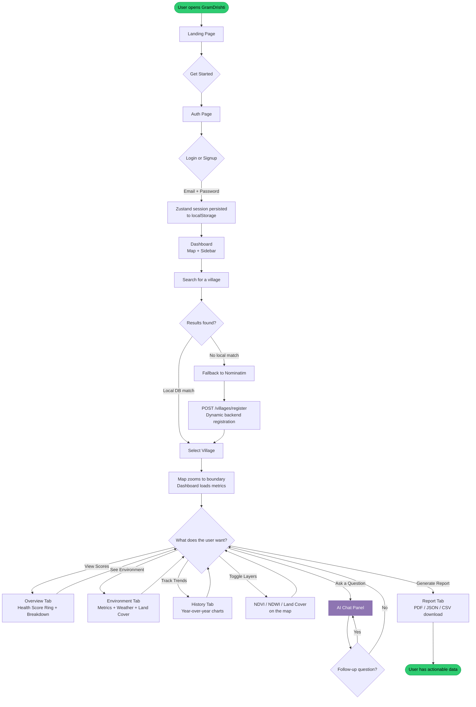
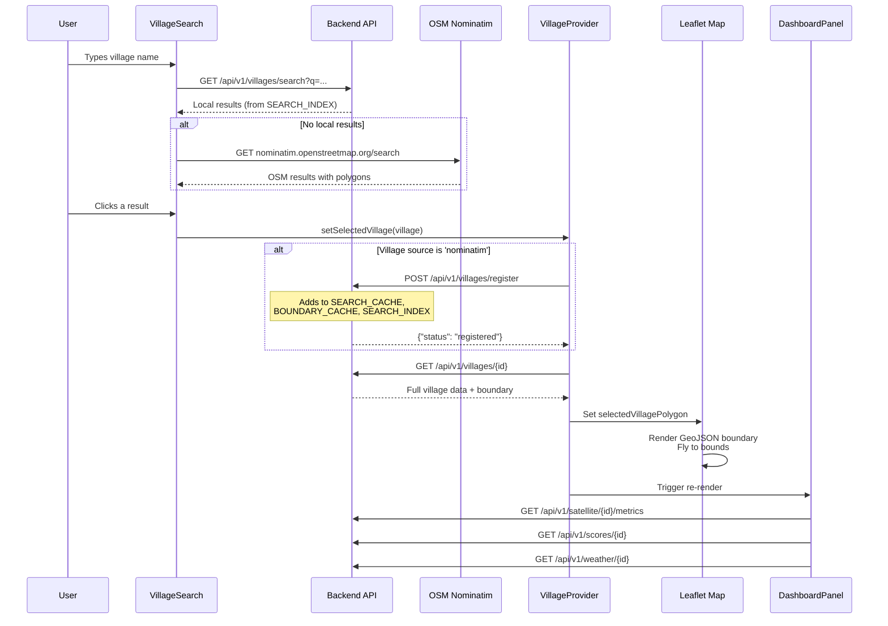
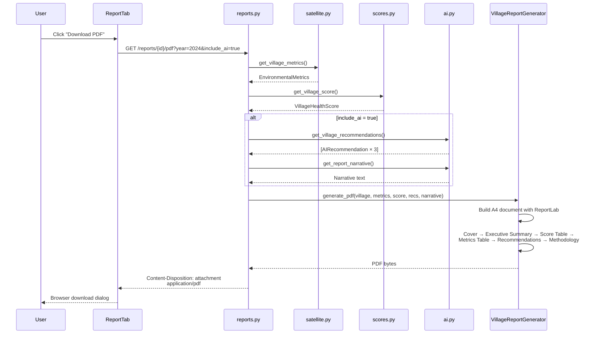
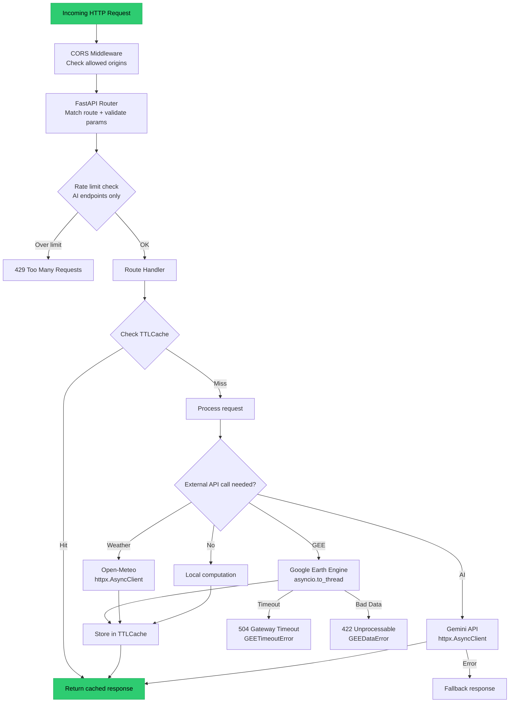
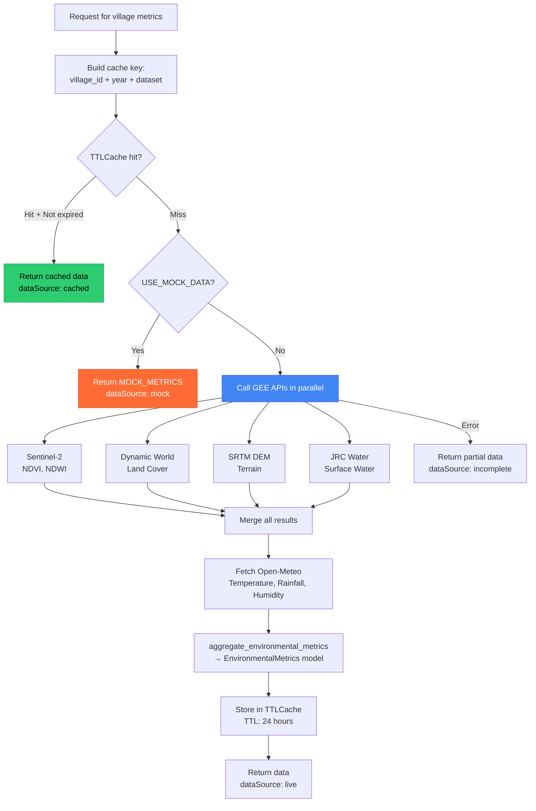
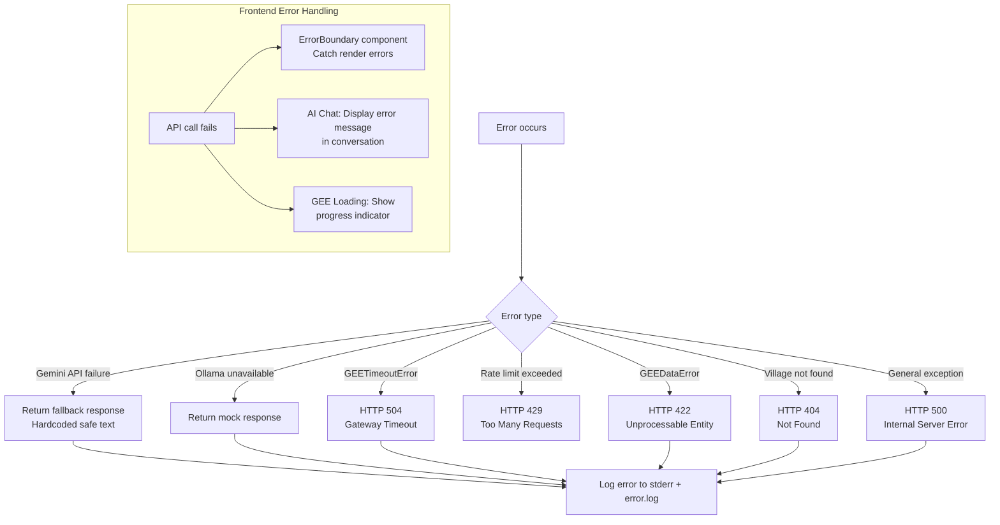
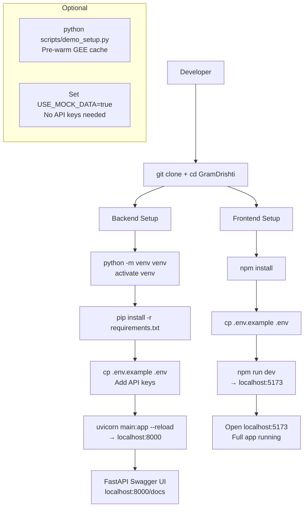
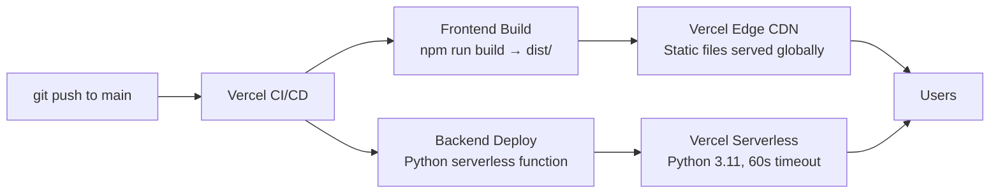
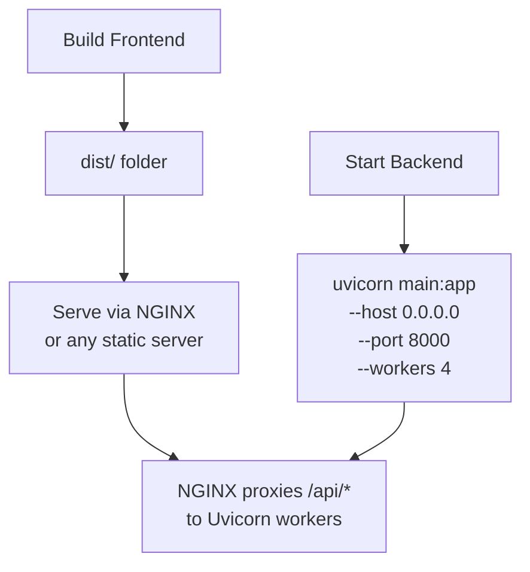

# Project Workflow — GramDrishti

Detailed workflow diagrams for every major process in the GramDrishti platform.

---

## Table of Contents

- [User Workflow](#user-workflow)
- [Village Selection Workflow](#village-selection-workflow)
- [Dashboard Data Loading](#dashboard-data-loading)
- [AI Chat Workflow](#ai-chat-workflow)
- [Report Generation Workflow](#report-generation-workflow)
- [Backend Request Lifecycle](#backend-request-lifecycle)
- [GEE Data Retrieval Workflow](#gee-data-retrieval-workflow)
- [Error Handling Flow](#error-handling-flow)
- [Development Workflow](#development-workflow)
- [Deployment Workflow](#deployment-workflow)

---

## User Workflow

The complete end-to-end user journey from landing to action.



---

## Village Selection Workflow

What happens internally when a user selects a village.



---

## Dashboard Data Loading

Parallel data fetching when a village is selected.

```mermaid
flowchart TD
    Select[Village Selected] --> Par{Parallel API Calls}

    Par --> Metrics[GET /satellite/{id}/metrics<br/>NDVI, NDWI, Land Cover, Weather]
    Par --> Scores[GET /scores/{id}<br/>5-dimension health scores]
    Par --> Weather[GET /weather/{id}<br/>Current conditions]
    Par --> Recs[POST /ai/{id}/recommendations<br/>AI-generated insights]

    Metrics --> Cache1{In cache?}
    Cache1 -->|Yes| Fast1[Return cached<br/>~50ms]
    Cache1 -->|No| GEE[Call Google Earth Engine<br/>~45 seconds]
    GEE --> Aggregate[Aggregator: raw GEE → EnvironmentalMetrics]
    Aggregate --> Store1[Store in TTLCache<br/>24h expiry]
    Store1 --> Fast1

    Scores --> Calc[Scoring Engine<br/>Depends on metrics]
    Calc --> Score[5 ScoreDetails + Overall]

    Fast1 --> Render[Dashboard renders:<br/>Overview, Environment, History tabs]
    Score --> Render
    Weather --> Render
    Recs --> Render

    style GEE fill:#4285f4,stroke:#3367d6,color:#fff
    style Render fill:#2ecc71,stroke:#27ae60,color:#000
```

---

## AI Chat Workflow

The complete AI pipeline from question to rendered response.

```mermaid
flowchart TD
    Q[User types question] --> Payload[Build payload:<br/>question, language, history,<br/>mapState, clickedLocation]
    Payload --> SSE[POST /ai/{village_id}/chat<br/>SSE Stream]

    SSE --> Init["▶ {status: initializing}"]
    Init --> Classify[Intent Classifier<br/>Gemini or keyword fallback]
    Classify --> Intents["Intents: [agriculture, water, ...]"]

    Intents --> Retrieve["▶ {status: retrieving}"]
    Retrieve --> RE[Retrieval Engine]
    RE --> VillageData[Fetch village + metrics + score]
    RE --> WeatherData{Intent needs weather?}
    WeatherData -->|Yes| FetchWeather[Fetch Open-Meteo data]
    WeatherData -->|No| Skip1[Skip]
    RE --> HistoryData{Intent needs history?}
    HistoryData -->|Yes| FetchHistory[Fetch 4 years of data]
    HistoryData -->|No| Skip2[Skip]
    RE --> PointData{User clicked map?}
    PointData -->|Yes| SamplePoint[Sample raster at coordinates]
    PointData -->|No| Skip3[Skip]

    VillageData --> ContextBlocks[context_blocks<br/>with source attribution]
    FetchWeather --> ContextBlocks
    FetchHistory --> ContextBlocks
    SamplePoint --> ContextBlocks
    Skip1 --> ContextBlocks
    Skip2 --> ContextBlocks
    Skip3 --> ContextBlocks

    ContextBlocks --> Confidence[Confidence Calculator<br/>0.35×GIS + 0.25×Weather +<br/>0.20×History + 0.20×Predictions]

    Confidence --> Process["▶ {status: processors}"]
    Process --> AgricProc[Agriculture Processor<br/>NDVI metrics, charts, actions]
    Process --> WaterProc[Water Processor<br/>NDWI, rainfall metrics]
    Process --> DisasterProc[Disaster Processor<br/>Flood risk assessment]
    Process --> SchemeProc[Scheme Engine<br/>Government scheme matching]

    AgricProc --> StructJSON[structured_json =<br/>{retrieved_data, processor_insights}]
    WaterProc --> StructJSON
    DisasterProc --> StructJSON
    SchemeProc --> StructJSON

    StructJSON --> LLM["▶ {status: llm}"]
    LLM --> Prompt[Prompt Builder<br/>Hallucination guards +<br/>Structured JSON context]
    Prompt --> Gemini[Gemini 2.5 Flash<br/>Generate narrative]

    Gemini --> Complete["▶ {status: completed}"]
    Complete --> Response["{answer, structured_data,<br/>follow_up_questions}"]

    Response --> Render[Frontend renders:<br/>MessageCard + DynamicChart<br/>+ ActionPanel + FollowUpChips]

    style Q fill:#2ecc71,stroke:#27ae60,color:#000
    style Gemini fill:#8e75b2,stroke:#7c5fad,color:#fff
    style Render fill:#2ecc71,stroke:#27ae60,color:#000
```

---

## Report Generation Workflow



---

## Backend Request Lifecycle

How a typical API request flows through the backend.



---

## GEE Data Retrieval Workflow

How satellite data is fetched and cached.



---

## Error Handling Flow



---

## Development Workflow



---

## Deployment Workflow

### Vercel Deployment



### Manual Production Deploy



---

*For system architecture details, see [ARCHITECTURE.md](ARCHITECTURE.md). For demo instructions, see [DEMO_GUIDE.md](DEMO_GUIDE.md).*
