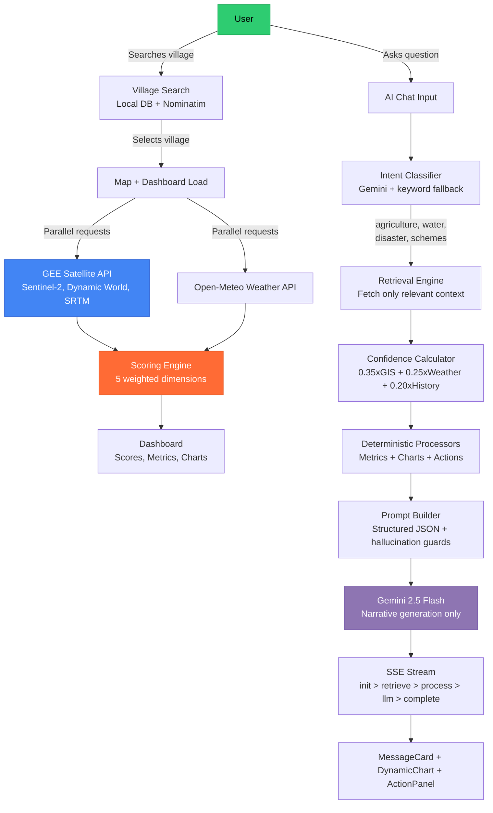

<div align="center">
  
  <h1>GramDrishti &nbsp;·&nbsp; ग्रामदृष्टि</h1>
  <p><strong>AI-Powered Environmental Intelligence Platform for Indian Villages</strong></p>
  <p><em>Translating satellite data into actionable decisions for 640,000+ Gram Panchayats</em></p>

  [](https://python.org)
  [](https://fastapi.tiangolo.com)
  [](https://react.dev)
  [](https://typescriptlang.org)
  [](https://earthengine.google.com)
  [](https://ai.google.dev)
  [](LICENSE)
</div>

---

| | |
|---|---|
| **Live Application** | [gram-drishti.vercel.app](https://gram-drishti.vercel.app/) |
| **Demo Video** | [youtu.be/g-fqo-nGJoQ](https://youtu.be/g-fqo-nGJoQ?si=1nMoQmWFnBggIdav) |
| **API Docs** | [localhost:8000/docs](http://localhost:8000/docs) (when running locally) |

---

## What Is GramDrishti?

GramDrishti is a Geographic Decision Support System (GDSS) built for India's 640,000+ Gram Panchayats. It connects three data sources — **Google Earth Engine satellite imagery**, **Open-Meteo weather data**, and **Google Gemini AI** — into a single dashboard where any village administrator can:

- Search for any Indian village by name
- See a satellite-derived **environmental health score** across five dimensions (water, vegetation, climate, flood risk, land use)
- Chat with an **AI that is grounded in that village's real data**, not general knowledge
- Download formal **PDF / JSON / CSV reports** suitable for government submission

The interface is available in English, Hindi, and Marathi.

---

## The Problem

India has **640,000+ villages** governed by Gram Panchayats — local councils that control water management, agriculture, disaster preparedness, and land use for over **800 million rural residents**. These councils make consequential decisions with little to no environmental data.

| Stakeholder | Gap |
|---|---|
| Gram Panchayat Officials | Decisions based on intuition or reports that are years old |
| District Administrators | No way to compare environmental health across jurisdictions |
| Farmers | No access to vegetation or water indices for their region |
| Disaster Response Teams | No pre-computed flood risk at the village level |
| Policy Makers | Cannot match government schemes to villages based on conditions |

Existing tools fail because Google Earth Engine requires programming expertise, government MIS portals track spending (not environment), weather apps don't tie to village boundaries, and generic AI assistants hallucinate when asked about specific villages.

---

## The Solution

GramDrishti is built around three connected systems:

**1. Satellite-to-Score Pipeline**

Google Earth Engine raster data (NDVI, NDWI, Land Cover, SRTM Terrain) and Open-Meteo weather data are aggregated into a weighted composite health score:

| Dimension | Weight | Data Sources |
|---|---|---|
| Water Security | 25% | NDWI, Surface Water Area, Rainfall |
| Vegetation Health | 25% | NDVI, Green Cover %, Tree Cover |
| Climate Stability | 20% | Temperature, Humidity, Drought Risk |
| Flood Preparedness | 15% | Terrain Slope, Flood Area %, Rainfall |
| Land Sustainability | 15% | Bare Land %, Built Area %, Cropland |

**2. Deterministic AI — Not an LLM Wrapper**

The AI pipeline separates computation from narration. Python processors compute every metric, chart, and threshold-based recommendation deterministically, without any LLM involvement. Gemini only generates the narrative layer, constrained by a structured JSON context with explicit hallucination guards. The system enforces an `Evidence → Reasoning → Recommendation → Expected Outcome` structure.

**3. Interactive GIS and AI Feedback Loop**

Users can click any point on the map. Those coordinates — along with the currently active GIS layers — are sent to the AI as context, enabling spatially-aware, location-specific responses.

---

## Key Features

| Feature | What It Does |
|---|---|
| Village Search | Local GeoJSON DB with automatic fallback to OpenStreetMap Nominatim for any Indian village |
| 5-Dimension Health Score | Weighted composite (0–100) with per-dimension breakdown and year-over-year trend badges |
| Interactive Choropleth Map | GeoJSON village boundaries color-coded by NDVI category via Leaflet |
| Satellite Layer Overlays | Toggle NDVI, NDWI, and Land Cover raster overlays from GEE tile servers |
| RAG-Grounded AI Chat | SSE-streamed AI responses with real-time pipeline status indicators |
| Deterministic Processors | Agriculture, Water, Disaster, and Schemes processors compute metrics without LLM |
| Government Scheme Matching | Automatically matches village conditions to PMKSY, Soil Health Card, MGNREGA, and others |
| Report Exports | PDF (ReportLab), JSON, and CSV download from the dashboard |
| Multi-Language UI + AI | Full translations for English, Hindi, and Marathi; AI responds in the selected language |
| Map-Click AI Context | Clicked coordinates are sent to the AI for point-level spatial analysis |
| Historical Trends | Year-over-year metrics and scores from 2022–2026 with trend charts |
| Audit Logging | Every AI query is JSONL-logged with datasets, processors, confidence scores, and timing |

---

## How It Works



---

## User Journey

**Discovery:** User signs in and arrives at the dashboard — a split panel with an interactive Leaflet map and a data sidebar.

**Village Selection:** The search bar returns results from the local GeoJSON index first. If a village is not found locally, the system falls back to OpenStreetMap Nominatim, registers the village boundary on the backend, and proceeds identically.

**Exploration:** Once a village is selected, the map zooms to its GeoJSON boundary and the dashboard begins loading satellite metrics. The Overview tab shows the health score ring and score breakdown. The Environment tab shows raw metrics and weather. The History tab shows year-over-year trend charts. GIS layers (NDVI, NDWI, Land Cover) can be toggled on the map.

**AI Interaction:** The user opens the AI Chat panel and asks any question. The chat displays real-time pipeline status indicators as the system classifies intent, retrieves data, runs processors, and generates the narrative. The response includes embedded charts, metric cards, and action buttons that interact directly with the map.

**Reporting:** The Report tab lets users download a PDF with cover page, executive summary, health scores, metrics tables, prioritized recommendations, and data methodology — ready for government submission.

---

## What Makes It Different

**Deterministic computation, not LLM guessing.** Every number in an AI response comes from a Python processor, not Gemini. The LLM only writes sentences about data it is explicitly given.

**Confidence scoring with source attribution.** Each data retrieval carries `source`, `timestamp`, and `confidence` metadata. The confidence formula (`0.35 × GIS + 0.25 × Weather + 0.20 × History + 0.20 × Predictions`) is disclosed to the AI, which is instructed to say "This information is currently unavailable" rather than invent values.

**AI-controlled map interactions.** The AI can return `{"type": "toggle_layer", "layer": "ndvi"}` action payloads. The frontend parses these and manipulates map state directly — creating a conversation-to-visualization feedback loop.

**Any village in India.** The Nominatim fallback with dynamic backend registration means the full satellite, scoring, and AI pipeline works for any village in the country, not just pre-loaded ones.

**Full audit trail.** Every AI interaction is logged in JSONL format: query, classified intents, retrieved datasets, executed processors, structured JSON size, prompt length, response length, confidence scores, and execution time.

---

## Repository Structure

```
GramDrishti/
├── frontend/                       # React 18 + Vite + TypeScript + Tailwind
│   └── src/
│       ├── components/
│       │   ├── ai/                 # AIChatPanel, MessageCard, DynamicChart, ActionPanel
│       │   ├── dashboard/          # DashboardPanel, OverviewTab, EnvironmentTab, HistoryTab, ReportTab
│       │   ├── map/                # MapContainer, ChoroplethLayer, NDVILayer, VillageBoundary, LayerControl
│       │   ├── landing/            # Hero, Features, HowItWorks, Stats, Technology, CTA
│       │   ├── layout/             # AppLayout, Header, LanguageSwitcher
│       │   └── ui/                 # Button, Card, Skeleton, GEEProgress, ErrorBoundary
│       ├── hooks/                  # useAIChat, useVillageSelection, useSatelliteData, useScores
│       ├── locales/                # en/, hi/, mr/ translation files
│       ├── services/               # Axios API client, Report download service
│       └── types/                  # TypeScript interfaces for all domain models
│
├── backend/                        # FastAPI + Python 3.11
│   ├── main.py                     # App entry, CORS, startup, router registration
│   └── app/
│       ├── api/routes/             # ai.py, satellite.py, scores.py, villages.py,
│       │                           # weather.py, history.py, analysis.py, reports.py
│       ├── services/
│       │   ├── ai/                 # ai_service.py, classifier.py, retrieval_engine.py,
│       │   │                       # processors/, prompt_builder.py, confidence.py, audit.py
│       │   ├── gee/                # processor.py, sentinel2.py, dynamic_world.py, water.py, terrain.py
│       │   ├── scoring/            # health_score.py, aggregator.py, history.py, risk_ranker.py
│       │   └── reports/            # PDF, JSON, CSV exporters
│       └── utils/                  # TTLCache, geo utilities
│
├── scripts/
│   ├── demo_setup.py               # Pre-warm GEE cache for 5 demo villages x 5 years
│   └── fetch_real_boundaries.py    # Fetch real village boundaries from OSM
│
├── ARCHITECTURE.md                 # System architecture with Mermaid diagrams
├── PROJECT_WORKFLOW.md             # Workflow diagrams for every major process
├── DEMO_GUIDE.md                   # Step-by-step demo script with judge checklist
├── FUTURE_SCOPE.md                 # Roadmap, scaling plan, business opportunities
├── CONTRIBUTING.md                 # Contribution guide, coding standards, PR checklist
├── CHANGELOG.md                    # Version history
└── LICENSE                         # MIT
```

---

## Quick Start

### Prerequisites

| Tool | Version | Purpose |
|---|---|---|
| Python | 3.11+ | Backend runtime |
| Node.js | 18+ | Frontend runtime |
| Google Gemini API Key | Any tier | AI chat and intent classification |
| Google Earth Engine | Service Account | Live satellite data (optional — mock data available) |

### Backend

```bash
cd backend
python -m venv venv

# Windows
venv\Scripts\activate
# macOS / Linux
source venv/bin/activate

pip install -r requirements.txt
cp .env.example .env
# Add GEMINI_API_KEY to .env (set USE_MOCK_DATA=true to skip GEE setup)

uvicorn main:app --reload
# API docs: http://localhost:8000/docs
```

### Frontend

```bash
cd frontend
npm install
cp .env.example .env
npm run dev
# App: http://localhost:5173
```

### Cache Warmup (for demos)

```bash
# With the backend running:
python scripts/demo_setup.py
```

This pre-fetches all satellite metrics, health scores, AI summaries, and recommendations for the 5 demo villages across 5 years — reducing first-load time from ~45 seconds to under 2 seconds.

### Environment Variables

<details>
<summary><strong>Backend (backend/.env)</strong></summary>

| Variable | Description | Required | Default |
|---|---|---|---|
| `GEMINI_API_KEY` | Google Gemini API key | Yes | — |
| `GEE_PROJECT_ID` | Google Earth Engine project ID | Live data only | — |
| `GEE_SERVICE_ACCOUNT_EMAIL` | GEE service account email | Live data only | — |
| `GEE_CREDENTIALS_PATH` | Path to GEE JSON key file | Live data only | `./credentials/gee_credentials.json` |
| `USE_MOCK_DATA` | Use built-in deterministic mock data | No | `false` |
| `ALLOWED_ORIGINS` | CORS allowed origins (comma-separated) | No | `http://localhost:5173` |
| `DEBUG` | Enable debug logging | No | `true` |

</details>

<details>
<summary><strong>Frontend (frontend/.env)</strong></summary>

| Variable | Description | Default |
|---|---|---|
| `VITE_API_URL` | Backend base URL | `http://localhost:8000` |

</details>

> No GEE credentials? Set `USE_MOCK_DATA=true`. The system includes deterministic mock data for all 5 demo villages across 5 years. All features — health scores, AI chat, PDF reports, historical trends — work fully with mock data.

---

## Demo Villages

| Village | District | Scenario |
|---|---|---|
| Mulshi | Pune | Declining across all metrics (NDVI: 0.61 → 0.48, 2022–2026) |
| Maval | Pune | Steadily improving |
| Ambegaon | Pune | Gradual decline |
| Khed | Pune | Faster decline, drier conditions |
| Junnar | Pune | Improving trend |

---

## Roadmap

**Phase 1 — Hackathon MVP (current)**
- [x] 5-dimension weighted health scoring engine
- [x] Google Earth Engine integration (Sentinel-2, Dynamic World, SRTM)
- [x] RAG-grounded AI chat with SSE streaming
- [x] Deterministic processors: Agriculture, Water, Disaster, Schemes
- [x] Interactive Leaflet map with NDVI / NDWI / Land Cover overlays
- [x] PDF / JSON / CSV report generation
- [x] Multi-language support: EN, HI, MR
- [x] Dynamic village registration via Nominatim

**Phase 2 — Post-Hackathon (1–3 months)**
- [ ] PostgreSQL + PostGIS for persistent village storage
- [ ] Redis for shared distributed caching
- [ ] Role-based access control (Admin, Official, Viewer)
- [ ] Threshold breach notification system

**Phase 3 — Expansion (3–6 months)**
- [ ] Random Forest crop yield prediction on historical NDVI + weather
- [ ] Soil type raster layer
- [ ] Webhook integration with Ministry of Panchayati Raj APIs

**Long-term**
- [ ] React Native mobile app for offline field-worker deployment
- [ ] Real-time satellite refresh on new Sentinel-2 passes
- [ ] State and national-level aggregation dashboards

---

## FAQ

<details>
<summary><strong>Do I need Google Earth Engine credentials?</strong></summary>

No. Set `USE_MOCK_DATA=true` in `backend/.env`. The system includes deterministic mock data for Mulshi, Maval, Ambegaon, Khed, and Junnar across 2022–2026. All features work fully.
</details>

<details>
<summary><strong>Why does the first dashboard load take ~45 seconds?</strong></summary>

Google Earth Engine computes satellite metrics on-the-fly for any arbitrary polygon. The computation runs on Google's servers and takes ~45 seconds on a cold start. Subsequent requests for the same village and year are served from the in-memory TTL cache in under 2 seconds. Run `python scripts/demo_setup.py` before demos to pre-warm the cache.
</details>

<details>
<summary><strong>Can I analyze any village in India?</strong></summary>

Yes. If a village isn't in the pre-loaded GeoJSON database, the search bar falls back to OpenStreetMap Nominatim, retrieves the GeoJSON boundary, and dynamically registers it on the backend. All satellite, scoring, and AI features then work identically.
</details>

<details>
<summary><strong>How is hallucination prevented?</strong></summary>

Three mechanisms: (1) All numeric metrics, charts, and thresholds are computed by Python processors — not the LLM. (2) The LLM receives a structured JSON context and explicit instructions to state "This information is currently unavailable" for any missing data, never to invent values. (3) A confidence score based on data availability is disclosed to the AI and included in its response.
</details>

<details>
<summary><strong>What happens when the Gemini API is unavailable?</strong></summary>

The system falls back to Ollama (local Qwen 2.5). If both are unavailable, hardcoded fallback responses ensure the application never crashes. All non-AI features (map, scores, metrics, reports) are unaffected.
</details>

---

## Acknowledgements

**Data Sources**
- [Google Earth Engine](https://earthengine.google.com) — Sentinel-2, Dynamic World, SRTM DEM, JRC Water Occurrence
- [Open-Meteo](https://open-meteo.com) — Historical and current weather (open source, no API key required)
- [OpenStreetMap / Nominatim](https://nominatim.openstreetmap.org) — Village boundary geocoding

**AI**
- [Google Gemini 2.5 Flash](https://ai.google.dev) — Narrative generation, intent classification
- [Ollama](https://ollama.ai) — Local LLM fallback (Qwen 2.5)

**Core Libraries**
[FastAPI](https://fastapi.tiangolo.com) · [React](https://react.dev) · [Vite](https://vite.dev) · [Leaflet](https://leafletjs.com) · [ECharts](https://echarts.apache.org) · [Framer Motion](https://www.framer.com/motion) · [Zustand](https://zustand.docs.pmnd.rs) · [i18next](https://www.i18next.com) · [ReportLab](https://www.reportlab.com) · [Tailwind CSS](https://tailwindcss.com)

---

## Documentation

| File | Description |
|---|---|
| [ARCHITECTURE.md](ARCHITECTURE.md) | System design, component diagrams, data flow, design decisions |
| [PROJECT_WORKFLOW.md](PROJECT_WORKFLOW.md) | Mermaid diagrams for every major workflow |
| [DEMO_GUIDE.md](DEMO_GUIDE.md) | Minute-by-minute demo script with judge checklist |
| [FUTURE_SCOPE.md](FUTURE_SCOPE.md) | Roadmap, scaling plan, business model |
| [CONTRIBUTING.md](CONTRIBUTING.md) | Contribution guide, coding standards, PR checklist |
| [CHANGELOG.md](CHANGELOG.md) | Version history |

---

<div align="center">
  <sub>GramDrishti — ग्रामदृष्टि — "Vision for Villages"</sub>
</div>
