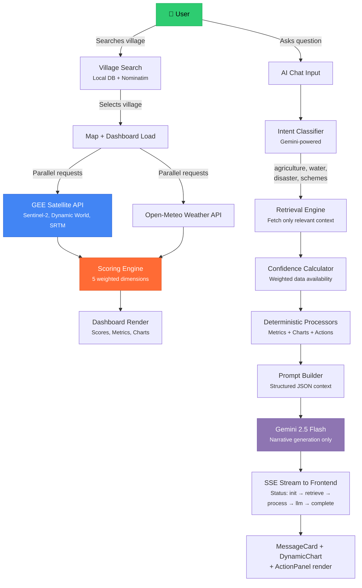

<div align="center">
  
  
  # GramDrishti (ग्रामदृष्टि)
  
  **AI-Powered Climate Intelligence Platform for Indian Villages**

  *Translating satellite data into actionable decisions for 640,000+ Gram Panchayats*

  [](https://python.org)
  [](https://fastapi.tiangolo.com)
  [](https://react.dev)
  [](https://typescriptlang.org)
  [](https://vite.dev)
  [](https://tailwindcss.com)
  [](https://earthengine.google.com)
  [](https://ai.google.dev)
  [](LICENSE)
  [](https://buildforgood.dev)

</div>

---

## Quick Links

| | |
|---|---|
| **Live Application** | [https://gram-drishti.vercel.app/](https://gram-drishti.vercel.app/) |
| **Demo Video** | [https://youtu.be/g-fqo-nGJoQ?si=1nMoQmWFnBggIdav](https://youtu.be/g-fqo-nGJoQ?si=1nMoQmWFnBggIdav) |
| **Architecture Docs** | [docs/ARCHITECTURE.md](docs/ARCHITECTURE.md) |

---

## The Problem & Solution

## 📋 Table of Contents

- [Elevator Pitch](#-elevator-pitch)
- [Problem Statement](#-problem-statement)
- [Our Solution](#-our-solution)
- [Key Features](#-key-features)
- [How It Works](#-how-it-works)
- [User Journey](#-user-journey)
- [Screenshots](#-screenshots)
- [Demo](#-demo)
- [Innovation](#-innovation)
- [Real-World Applications](#-real-world-applications)
- [Scalability](#-scalability)
- [Repository Structure](#-repository-structure)
- [Quick Start](#-quick-start)
- [Team](#-team)
- [Roadmap](#-roadmap)
- [FAQ](#-faq)
- [Acknowledgements](#-acknowledgements)
- [Documentation](#-documentation)

---

## 🎯 Elevator Pitch

GramDrishti is a Geographic Decision Support System that gives Gram Panchayats (village councils) the same environmental intelligence that corporations pay millions for. It connects Google Earth Engine satellite data (Sentinel-2, Dynamic World, SRTM), Open-Meteo weather APIs, and Google Gemini AI into a single dashboard where a village administrator can search for any Indian village, see its environmental health score across five dimensions (water, vegetation, climate, flood risk, land use), chat with an AI that is grounded entirely in the village's real data, and download formal PDF reports—all in English, Hindi, or Marathi.

---

## 🔍 Problem Statement

### The Crisis

India has **640,000+ villages** governed by Gram Panchayats—local councils that make decisions about water management, agriculture, disaster preparedness, and land use. These decisions affect over **800 million rural residents**.

### Who Is Affected

| Stakeholder | Pain Point |
|---|---|
| **Gram Panchayat Officials** | Make land and water decisions without data; rely on intuition or outdated reports |
| **District Administrators** | Cannot compare village health across their jurisdiction |
| **Farmers** | No access to vegetation indices or weather trend analysis for their region |
| **Disaster Response Teams** | Lack pre-computed flood risk assessments at the village level |
| **Policy Makers** | Cannot match government schemes to the villages that need them most |

### Why Existing Tools Fail

- **Google Earth Engine** is a powerful platform, but it requires programming expertise and has no decision-support layer on top.
- **Government MIS portals** track administrative metrics (funds spent, schemes disbursed) but not environmental health.
- **Weather apps** provide forecasts but not historical trend analysis tied to a specific village boundary.
- **Generic AI assistants** hallucinate when asked about specific villages because they lack grounded geospatial data.

> There is no single tool today where a Gram Panchayat official can type a village name, immediately see its satellite-derived environmental health, and get AI recommendations grounded in that data.

---

## 💡 Our Solution

GramDrishti bridges the gap between raw satellite data and village-level decision making through three connected systems:

### 1. Satellite-to-Score Pipeline
GEE raster data (NDVI, NDWI, Land Cover, Terrain) and Open-Meteo weather data are aggregated into a **composite health score** across five weighted dimensions:

| Dimension | Weight | Data Sources |
|---|---|---|
| Water Security | 25% | NDWI, Surface Water Area, Rainfall |
| Vegetation Health | 25% | NDVI, Green Cover %, Tree Cover |
| Climate Stability | 20% | Temperature, Humidity, Drought Risk |
| Flood Preparedness | 15% | Terrain Slope, Flood Area %, Rainfall |
| Land Sustainability | 15% | Bare Land %, Built Area %, Cropland |

### 2. Deterministic AI (Not Just an LLM Wrapper)
Instead of dumping raw data into an LLM context window, GramDrishti uses an **Agentic Deterministic Processor** architecture:
- **Intent Classifier** routes queries to domain-specific processors (Agriculture, Water, Disaster, Schemes).
- **Processors** compute metrics, charts, and action buttons deterministically—no LLM involved.
- **Gemini** only handles the narrative layer, constrained by a structured JSON context with hallucination guards.

### 3. Interactive GIS + AI Feedback Loop
Users can click any point on the map, and the clicked coordinates are sent to the AI along with the active map layers—enabling location-aware, context-sensitive responses.

---

## ✨ Key Features

| Feature | Description | Benefit | User Value |
|---|---|---|---|
| **Village Search** | Search any Indian village by name via local DB + OpenStreetMap Nominatim fallback | Works for all 640K+ villages, not just pre-loaded ones | Any village, anywhere |
| **5-Dimension Health Score** | Weighted composite score (0–100) with per-dimension breakdown and trend indicators | Quantifies "how healthy is this village" in one number | Instant situational awareness |
| **Interactive Choropleth Map** | GeoJSON boundaries rendered with Leaflet; color-coded by NDVI category | Compare villages visually across a region | Regional benchmarking |
| **NDVI / NDWI / Land Cover Layers** | Toggle satellite raster overlays generated from GEE tile servers | See vegetation, water, and land use on the map | Ground-truth verification |
| **AI Chat (RAG-Grounded)** | Conversational AI with real-time SSE streaming, pipeline status updates, and structured responses | Ask questions about a village and get answers backed by satellite data | Data-driven decisions |
| **Deterministic Processors** | Python processors that compute metrics, charts, and action buttons without LLM involvement | Charts and numbers are always accurate—only narrative uses AI | Trust in the data |
| **Government Scheme Matching** | Automatically matches village conditions to schemes (PMKSY, Soil Health Card, etc.) | Officials discover applicable schemes based on actual environmental data | Better fund allocation |
| **PDF / JSON / CSV Reports** | Downloadable reports with AI narrative, health scores, metrics tables, and recommendations | Formal documentation for government submissions | Accountability |
| **Multi-language Support** | Full i18n for English, Hindi, and Marathi (UI + AI responses) | Accessible to non-English-speaking officials | Inclusivity |
| **Map-Click AI Context** | Clicking a location sends coordinates to the AI; AI responds with point-level analysis | "What's happening at this specific field?" | Precision queries |
| **Historical Trend Analysis** | Year-over-year metrics and scores (2022–2026) with trend badges | Track whether interventions are working | Impact measurement |
| **Audit Logging** | Every AI query is logged with retrieved datasets, executed processors, confidence scores, and execution time | Full transparency and reproducibility | Explainable AI |

---

## ⚙️ How It Works



---

## 🗺️ User Journey

### Beginning: Discovery
1. User lands on the **landing page** with an overview of the platform's capabilities.
2. User signs up or logs in via the **auth page** (client-side session with Zustand persist).
3. User is redirected to the **main dashboard** — a split-panel layout with an interactive map on the left and a data panel on the right.

### Middle: Exploration
4. User **searches for a village** using the search bar. Results come from the local GeoJSON database first; if not found, the system falls back to OpenStreetMap Nominatim and dynamically registers the village on the backend.
5. On selection, the map **zooms to the village boundary** (GeoJSON polygon) and the dashboard panel begins loading satellite metrics (~45 seconds on first load, cached afterward).
6. The **Overview tab** shows the health score ring, score breakdown by dimension, and trend badges.
7. The **Environment tab** shows NDVI, rainfall, temperature, land cover pie chart, and weather widget.
8. The **History tab** shows year-over-year metric trends as line charts.
9. User **toggles GIS layers** (NDVI, NDWI, Land Cover) on the map to visually inspect satellite imagery.
10. User **clicks on a specific location** on the map, setting a point context for the AI.

### End: Action
11. User opens the **AI Chat panel** and asks a question like "How is the agriculture?" or "What government schemes apply here?"
12. The AI streams its response with real-time pipeline status indicators (`Retrieving data...`, `Running processors...`, `Generating response...`).
13. The AI response includes **embedded charts**, **metric cards**, and **action buttons** (e.g., "Toggle NDVI Layer") rendered natively in the chat.
14. User clicks **follow-up questions** suggested by the AI to drill deeper.
15. User opens the **Report tab** and downloads a **PDF report** with executive summary, health scores, metrics, and prioritized recommendations — ready for submission to district authorities.

---

## 📸 Screenshots

> **Note:** Replace placeholders with actual screenshots before submission.

| View | Screenshot |
|---|---|
| Landing Page | `📷 /assets/screenshots/landing.png` |
| Dashboard — Overview Tab | `📷 /assets/screenshots/dashboard-overview.png` |
| Interactive Map with NDVI Layer | `📷 /assets/screenshots/map-ndvi.png` |
| AI Chat with Structured Response | `📷 /assets/screenshots/ai-chat.png` |
| Health Score Breakdown | `📷 /assets/screenshots/health-score.png` |
| PDF Report | `📷 /assets/screenshots/pdf-report.png` |

---

## 🎬 Demo

> **Demo Video:** `📹 /assets/demo/gramdrishti-demo.mp4`

> **Live Demo:** [TODO: Add deployed URL]

### Quick Demo (5 Demo Villages)

For rapid testing, use these pre-configured villages:

| Village | District | Coordinates | Scenario |
|---|---|---|---|
| **Mulshi** | Pune | `18.52, 73.53` | Declining across all metrics |
| **Maval** | Pune | `18.77, 73.58` | Steadily improving |
| **Ambegaon** | Pune | `19.12, 73.72` | Slow decline |
| **Khed** | Pune | `18.83, 73.87` | Faster decline, drier |
| **Junnar** | Pune | `19.20, 73.88` | Improving |

> **Tip:** Pre-warm the cache with `python scripts/demo_setup.py` for instant load times during demos.

---

## 🧠 Innovation

### What Makes GramDrishti Different

**1. Deterministic AI, Not a Chatbot Wrapper**

Most hackathon projects send raw data to an LLM and hope for the best. GramDrishti's AI architecture splits computation from narration:
- **Processors** (Python scripts) deterministically compute every metric, chart, and threshold-based recommendation.
- **Gemini** only generates the explanatory narrative, constrained by a structured JSON context with explicit hallucination guards.
- The system enforces `Evidence → Reasoning → Recommendation → Expected Outcome` formatting.

**2. Source Attribution & Confidence Scoring**

Every piece of retrieved data carries metadata: `source`, `timestamp`, and `confidence`. The confidence calculator uses a weighted formula:

```
Confidence = (0.35 × GIS) + (0.25 × Weather) + (0.20 × History) + (0.20 × Predictions)
```

The AI is told its confidence level and instructed to state "This information is currently unavailable" rather than guess.

**3. AI-Controlled Map Interactions**

The AI can return action buttons (`{"type": "toggle_layer", "layer": "ndvi"}`) that the frontend parses to directly manipulate map state — creating a feedback loop between conversation and visualization.

**4. Any Village, Not Just Pre-Loaded Ones**

The village search falls back to OpenStreetMap Nominatim. When a user selects a Nominatim result, the frontend registers the village's GeoJSON boundary on the backend via `POST /api/v1/villages/register`, making all downstream endpoints (satellite, scores, AI) immediately available.

**5. Explainability Audit Trail**

Every AI interaction is logged in JSONL format with: the query, classified intents, retrieved datasets, executed processors, structured JSON size, prompt length, response length, confidence scores, and execution time. This makes the system auditable and reproducible.

---

## 🌍 Real-World Applications

| Sector | Use Case | Benefit |
|---|---|---|
| **Gram Panchayat Governance** | Monthly environmental health review meetings | Data-driven decision making for water and land use |
| **District Administration** | Compare 50+ villages on a choropleth map | Prioritize resource allocation by environmental risk |
| **Agriculture Extension** | NDVI trend analysis per village | Early detection of crop stress before harvest failures |
| **Disaster Management** | Flood preparedness scores + rainfall analysis | Pre-position relief resources in high-risk villages |
| **Government Scheme Allocation** | Automatic scheme matching based on village conditions | Connect PMKSY, Soil Health Card, MGNREGA to the right villages |
| **Climate Research** | Historical trend data (2022–2026) across regions | Study land-use change, deforestation, and urbanization at scale |
| **NGOs & Development Orgs** | Downloadable PDF/CSV reports | Ground-truth reporting for grant submissions |

---

## 📈 Scalability

### Current Architecture
- **Stateless Backend**: FastAPI with no database — data is fetched on-demand from GEE and Open-Meteo, cached in-memory with TTL.
- **Dynamic Village Registration**: Any village can be analyzed without pre-loading — Nominatim + dynamic registration handles arbitrary boundaries.
- **Horizontal Scaling**: Uvicorn workers can be scaled independently; the backend has no shared state between requests beyond the TTL cache.

### Scaling Path

| Phase | Change | Impact |
|---|---|---|
| **Phase 1** | Replace in-memory `TTLCache` with Redis | Shared cache across workers; survives restarts |
| **Phase 2** | Add PostgreSQL + PostGIS for persistent village data | Persistent village registry; spatial queries |
| **Phase 3** | Deploy behind NGINX with rate limiting | Production-grade traffic management |
| **Phase 4** | Move GEE tile generation to Cloud Functions | Offload heavy computation; independent scaling |
| **Phase 5** | Add Celery/RQ task queue for report generation | Non-blocking PDF generation for concurrent users |
| **Phase 6** | Kubernetes deployment with auto-scaling | Enterprise-grade infrastructure |

### What's Already Production-Ready
- Rate limiting (10 req/min per IP on AI endpoints)
- CORS configuration with configurable origins
- Structured error handling with custom exception types
- Request/response logging
- Environment-based configuration via `pydantic-settings`
- Vercel deployment configs for both frontend and backend

---

## 📁 Repository Structure

```
GramDrishti/
├── frontend/                          # React 18 + Vite + TypeScript
│   ├── src/
│   │   ├── components/
│   │   │   ├── ai/                    # AIChatPanel, MessageCard, DynamicChart, ActionPanel
│   │   │   ├── auth/                  # AuthLayout, LoginForm, SignupForm
│   │   │   ├── charts/               # HealthScoreTrendChart, LandCoverChart, NDVIPieChart
│   │   │   ├── dashboard/            # DashboardPanel, OverviewTab, EnvironmentTab, HistoryTab, ReportTab
│   │   │   │                         # HealthScoreRing, ScoreBreakdown, MetricsPanel, WeatherWidget
│   │   │   │                         # InsightsPanel, RecommendationCard, RiskDashboard
│   │   │   ├── landing/              # Hero, Features, HowItWorks, Stats, Technology, CTA, Navbar, Footer
│   │   │   ├── layout/               # AppLayout, Header, Sidebar, LanguageSwitcher
│   │   │   ├── map/                   # MapContainer, ChoroplethLayer, NDVILayer, WaterLayer,
│   │   │   │                         # LandCoverLayer, VillageBoundary, VillageSearch, LayerControl
│   │   │   ├── reports/              # Report export UI
│   │   │   └── ui/                    # Button, Card, Skeleton, GEEProgress, ErrorBoundary
│   │   ├── hooks/                     # useAIChat, useVillageSelection, useSatelliteData, useScores,
│   │   │                             # useAuth, useMapLayers, useRecommendations, useHistoricalData
│   │   ├── i18n/                      # i18next config
│   │   ├── locales/                   # en/, hi/, mr/ translation files
│   │   ├── pages/                     # LandingPage, AuthPage
│   │   ├── routes/                    # ProtectedRoute
│   │   ├── services/                  # Axios API client, Report download service
│   │   ├── store/                     # Zustand stores
│   │   ├── styles/                    # Global CSS
│   │   └── types/                     # TypeScript interfaces
│   ├── tailwind.config.ts
│   ├── vite.config.ts
│   └── package.json
│
├── backend/                           # FastAPI + Python 3.11
│   ├── main.py                        # App entry, CORS, startup event, router registration
│   ├── app/
│   │   ├── api/routes/                # 10 route modules:
│   │   │   ├── ai.py                  #   Chat SSE, Summary, Recommendations, Report Narrative
│   │   │   ├── satellite.py           #   Metrics, NDVI, Water, Land Cover, Terrain, Tiles
│   │   │   ├── scores.py              #   Health scores (5 dimensions)
│   │   │   ├── villages.py            #   Search, CRUD, Dynamic Registration, Boundaries
│   │   │   ├── weather.py             #   Current + Historical weather
│   │   │   ├── history.py             #   Year-over-year historical data
│   │   │   ├── analysis.py            #   Climate assessment, change detection
│   │   │   ├── recommendations.py     #   AI-powered recommendations
│   │   │   ├── reports.py             #   PDF, JSON, CSV report generation
│   │   │   └── health.py              #   Health check endpoint
│   │   ├── core/                      # Config (pydantic-settings), Logging, Custom Exceptions
│   │   ├── models/                    # Pydantic models: Village, Metrics, Scores, Recommendations
│   │   ├── services/
│   │   │   ├── ai/                    # AI Pipeline:
│   │   │   │   ├── ai_service.py      #   Orchestrator (classify → retrieve → process → generate)
│   │   │   │   ├── classifier.py      #   LLM-powered intent classification with keyword fallback
│   │   │   │   ├── retrieval_engine.py#   Modular context retrieval with source attribution
│   │   │   │   ├── processors/        #   agriculture.py, water.py, disaster.py, schemes.py
│   │   │   │   ├── prompt_builder.py  #   Dynamic prompt assembly with hallucination guards
│   │   │   │   ├── confidence.py      #   Weighted confidence scoring
│   │   │   │   ├── audit.py           #   JSONL audit logger
│   │   │   │   ├── gemini_client.py   #   Google Gemini 2.5 Flash client
│   │   │   │   ├── ollama_client.py   #   Ollama/Qwen fallback client
│   │   │   │   └── compressor.py      #   Context compression
│   │   │   ├── gee/                   # Google Earth Engine:
│   │   │   │   ├── processor.py       #   Orchestrator with caching, retries, mock data
│   │   │   │   ├── sentinel2.py       #   NDVI/NDWI tile generation
│   │   │   │   ├── dynamic_world.py   #   Land cover classification tiles
│   │   │   │   ├── water.py           #   JRC water occurrence tiles
│   │   │   │   ├── terrain.py         #   SRTM DEM elevation/slope
│   │   │   │   └── auth.py            #   GEE service account auth
│   │   │   ├── scoring/               # Health Score Engine:
│   │   │   │   ├── health_score.py    #   5-dimension weighted scoring (0–100)
│   │   │   │   ├── aggregator.py      #   Metric aggregation from raw GEE data
│   │   │   │   ├── environmental.py   #   Environmental assessment
│   │   │   │   ├── history.py         #   Historical data retrieval
│   │   │   │   └── risk_ranker.py     #   Risk ranking across dimensions
│   │   │   ├── weather/               # Open-Meteo integration
│   │   │   ├── reports/               # PDF (ReportLab), JSON, CSV exporters
│   │   │   └── village_service.py     # GeoJSON loader, search, boundary cache
│   │   └── utils/                     # TTL Cache, Geo utilities
│   ├── data/                          # GeoJSON village boundaries (Maharashtra)
│   ├── credentials/                   # GEE service account key (gitignored)
│   └── requirements.txt
│
├── scripts/
│   ├── demo_setup.py                  # Pre-warm GEE cache for demo villages
│   └── fetch_real_boundaries.py       # Fetch real village boundaries from OSM
│
├── docs/
│   └── ARCHITECTURE.md
│
├── ARCHITECTURE.md                    # System architecture documentation
├── PROJECT_WORKFLOW.md                # Workflow diagrams
├── DEMO_GUIDE.md                      # Step-by-step demo instructions
├── FUTURE_SCOPE.md                    # Roadmap and future plans
├── CONTRIBUTING.md                    # Contribution guidelines
├── CHANGELOG.md                       # Version history
├── LICENSE                            # MIT License
└── README.md                          # You are here
```

---

## Quick Start

### Prerequisites

| Tool | Version | Purpose |
|---|---|---|
| **Python** | 3.11+ | Backend runtime |
| **Node.js** | 18+ | Frontend runtime |
| **npm** | 9+ | Package manager |
| **Google Earth Engine** | Service Account | Satellite data access |
| **Google Gemini API Key** | Any tier | AI responses |

### 1. Clone the Repository

```bash
git clone https://github.com/Shwetapatil13/GramDrishti.git
cd GramDrishti
```

### 2. Backend Setup

```bash
cd backend

# Create and activate virtual environment
python -m venv venv
# Windows:
venv\Scripts\activate
# macOS/Linux:
source venv/bin/activate

# Install dependencies
pip install -r requirements.txt

# Configure environment
cp .env.example .env
# Edit .env with your API keys (see Environment Variables below)

# Start the server
uvicorn main:app --reload
```

> API docs: [http://localhost:8000/docs](http://localhost:8000/docs)

### 3. Frontend Setup

```bash
cd frontend

# Install dependencies
npm install

# Configure environment
cp .env.example .env

# Start development server
npm run dev
```

> App available at: `http://localhost:5173`

> App: [http://localhost:5173](http://localhost:5173)

### 4. (Optional) Pre-Warm Cache

```bash
# From the project root, with the backend running:
python scripts/demo_setup.py
```

### Environment Variables

<details>
<summary><strong>Backend (<code>backend/.env</code>)</strong></summary>

| Variable | Description | Required | Default |
|---|---|---|---|
| `GEE_PROJECT_ID` | Google Earth Engine project ID | For live data | — |
| `GEE_SERVICE_ACCOUNT_EMAIL` | GEE service account email | For live data | — |
| `GEE_CREDENTIALS_PATH` | Path to GEE JSON credentials | For live data | `./credentials/gee_credentials.json` |
| `GEMINI_API_KEY` | Google Gemini API key | Yes | — |
| `OPENMETEO_BASE_URL` | Open-Meteo API base URL | No | `https://api.open-meteo.com/v1` |
| `ALLOWED_ORIGINS` | CORS allowed origins (comma-separated) | No | `http://localhost:5173` |
| `USE_MOCK_DATA` | Use deterministic fallback data | No | `false` |
| `DEBUG` | Enable debug logging | No | `true` |

</details>

<details>
<summary><strong>Frontend (<code>frontend/.env</code>)</strong></summary>

| Variable | Description | Default |
|---|---|---|
| `VITE_API_URL` | Backend API base URL | `http://localhost:8000` |

</details>

> **No GEE credentials?** Set `USE_MOCK_DATA=true` in the backend `.env`. The system ships with deterministic mock data for all 5 demo villages across 5 years, so the full application workflow works without any external API access.

---

## 👥 Team

> Built for the **Build for Good Hackathon 2026**

<!-- Replace with actual team information -->

| Name | Role | GitHub |
|---|---|---|
| TODO | Full Stack Developer | [@TODO](https://github.com/TODO) |
| TODO | AI / Backend Engineer | [@TODO](https://github.com/TODO) |
| TODO | Frontend / UX | [@TODO](https://github.com/TODO) |

---

## 🛣️ Roadmap

### Phase 1: Current (Hackathon MVP) ✅
- [x] 5-dimension health scoring engine
- [x] Google Earth Engine integration (Sentinel-2, Dynamic World, SRTM)
- [x] RAG-grounded AI chat with SSE streaming
- [x] Deterministic processors (Agriculture, Water, Disaster, Schemes)
- [x] Interactive Leaflet map with GIS layers
- [x] PDF/JSON/CSV report generation
- [x] Multi-language support (EN, HI, MR)
- [x] Dynamic village registration via Nominatim

### Phase 2: Post-Hackathon (1–3 months)
- [ ] PostgreSQL + PostGIS for persistent storage
- [ ] Redis for distributed caching
- [ ] User accounts with role-based access (Admin, Official, Viewer)
- [ ] Notification system for threshold breaches

### Phase 3: Expansion (3–6 months)
- [ ] ML models for crop yield prediction (Random Forest on historical NDVI + weather)
- [ ] Soil type raster layer integration
- [ ] Webhook integration with Ministry of Panchayati Raj APIs
- [ ] API rate limiting with API keys for third-party access

### Long-Term Vision
- [ ] React Native mobile app for offline field-worker deployment
- [ ] Real-time satellite update cron jobs (on new Sentinel-2 passes)
- [ ] State-level and national-level aggregation dashboards
- [ ] Federated deployment model for state governments

---

## ❓ FAQ

<details>
<summary><strong>Do I need Google Earth Engine credentials to run this?</strong></summary>

No. Set `USE_MOCK_DATA=true` in `backend/.env`. The system includes deterministic mock data for 5 demo villages (Mulshi, Maval, Ambegaon, Khed, Junnar) across 5 years (2022–2026). All features work fully with mock data — health scores, AI chat, reports, and historical trends.
</details>

<details>
<summary><strong>Why does the first load take ~45 seconds?</strong></summary>

Google Earth Engine computes satellite metrics on-the-fly for any arbitrary polygon. The first request triggers computation on Google's servers. Subsequent requests are cached in-memory with a 24-hour TTL. Run `python scripts/demo_setup.py` to pre-warm the cache before demos.
</details>

<details>
<summary><strong>Can I analyze any village in India?</strong></summary>

Yes. If a village isn't in the pre-loaded GeoJSON database, the search bar falls back to OpenStreetMap Nominatim. When you select a result, the frontend dynamically registers the village boundary on the backend, enabling all satellite, scoring, and AI features.
</details>

<details>
<summary><strong>How do you prevent AI hallucination?</strong></summary>

Three mechanisms: (1) Deterministic processors compute all numeric metrics, charts, and thresholds without LLM involvement. (2) The LLM receives a structured JSON context with explicit instructions to never invent values and to state "This information is currently unavailable" for missing data. (3) Every query includes a confidence score based on data availability, which the LLM is required to disclose.
</details>

<details>
<summary><strong>What happens if the Gemini API is down?</strong></summary>

The system has a fallback to Ollama (local Qwen 2.5 model). If both are unavailable, hardcoded fallback responses are returned so the application never crashes. All non-AI features (maps, scores, metrics, reports) continue to work independently.
</details>

<details>
<summary><strong>Is the data accurate enough for policy decisions?</strong></summary>

The system uses the same satellite datasets (Sentinel-2, Dynamic World) that research institutions use. However, as stated in the generated reports: "Calculations are generalized for regional assessments and should be ground-truthed prior to major policy decisions." GramDrishti is a decision-support tool, not a replacement for field surveys.
</details>

---

## 🙏 Acknowledgements

### Data Sources
- [**Google Earth Engine**](https://earthengine.google.com) — Sentinel-2 imagery, Dynamic World land cover, SRTM DEM, JRC Water Occurrence
- [**Open-Meteo**](https://open-meteo.com) — Historical and current weather data (open-source, no API key required)
- [**OpenStreetMap / Nominatim**](https://nominatim.openstreetmap.org) — Village boundary geocoding

### AI
- [**Google Gemini 2.5 Flash**](https://ai.google.dev) — Narrative generation, intent classification
- [**Ollama**](https://ollama.ai) — Local LLM fallback (Qwen 2.5)

### Libraries & Frameworks
- [FastAPI](https://fastapi.tiangolo.com) · [React](https://react.dev) · [Vite](https://vite.dev) · [Leaflet](https://leafletjs.com) · [React Leaflet](https://react-leaflet.js.org) · [ECharts](https://echarts.apache.org) · [Framer Motion](https://www.framer.com/motion) · [TanStack Query](https://tanstack.com/query) · [Zustand](https://zustand.docs.pmnd.rs) · [i18next](https://www.i18next.com) · [ReportLab](https://www.reportlab.com) · [GeoPandas](https://geopandas.org) · [Tailwind CSS](https://tailwindcss.com)

### Hackathon
- **Build for Good Hackathon 2026** — For the platform and motivation

---

## 📚 Documentation

| Document | Description |
|---|---|
| [ARCHITECTURE.md](ARCHITECTURE.md) | System architecture, component diagrams, data flow, design decisions |
| [PROJECT_WORKFLOW.md](PROJECT_WORKFLOW.md) | User, admin, backend, and AI workflows with Mermaid diagrams |
| [DEMO_GUIDE.md](DEMO_GUIDE.md) | Step-by-step demo instructions with judge checklist |
| [FUTURE_SCOPE.md](FUTURE_SCOPE.md) | Roadmap, scaling plan, and business opportunities |
| [CONTRIBUTING.md](CONTRIBUTING.md) | Contribution guidelines, coding standards, PR checklist |
| [CHANGELOG.md](CHANGELOG.md) | Version history |

---

<div align="center">
  <sub>Built with 🌱 for the future of rural intelligence</sub>
  <br/>
  <sub>GramDrishti — ग्रामदृष्टि — "Vision for Villages"</sub>
</div>
