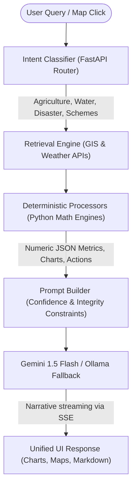

<div align="center">
  

  # GramDrishti &nbsp;·&nbsp; ग्रामदृष्टि
  ### **AI-Powered Climate Intelligence & Geospatial Analytics for Indian Villages**
  *Translating complex satellite observations and climate data into local actions for 640,000+ Gram Panchayats*

  [](https://gram-drishti.vercel.app/)
  [](https://youtu.be/FH3spiMOgDQ)
  [](LICENSE)

  <br /><br />

  

</div>

---

## 🔗 Quick Access

| Resource | Link / Access Method |
| :--- | :--- |
| 🌐 **Live Web Application** | [gram-drishti.vercel.app](https://gram-drishti.vercel.app/) |
| 🎥 **Video Walkthrough** | [YouTube Demo Link](https://youtu.be/FH3spiMOgDQ) |
| 📐 **Detailed System Architecture** | [docs/ARCHITECTURE.md](docs/ARCHITECTURE.md) |
| 📄 **Interactive API Docs** | [localhost:8000/docs](http://localhost:8000/docs) *(when running locally)* |

---

## 🌍 Vision & Impact

Over **640,000 Indian villages** governed by Gram Panchayats are experiencing accelerating climate stress—manifested through water depletion, vegetative drought, shifting monsoons, and extreme weather events. While state-level climate datasets are abundant, local administrative councils lack the GIS expertise to digest multi-spectral satellite imagery and translate it into local policy actions.

**GramDrishti (ग्रामदृष्टि)** addresses this data gap. It is a comprehensive **Geographic Decision Support System (GDSS)** that integrates multi-source geospatial data (Google Earth Engine, Open-Meteo, OpenStreetMap) and translates it into:
*   An aggregated, multi-dimensional **Village Health Score**.
*   High-fidelity, interactive **choropleth map layers** (NDVI, NDWI, Land Cover).
*   **Locally-tailored AI recommendations** generated in native Indian languages (**English, Hindi, and Marathi**) to guide water conservation, agriculture, and government scheme allocations.

---

## ⚠️ The Problem: Data Deficit in Local Governance

Rural councils manage water, crops, infrastructure, and disaster responses for over **800 million residents**, but operate in a complete information vacuum.

| Stakeholder Group | Information Deficit | Direct Impact |
| :--- | :--- | :--- |
| **Gram Panchayat Leaders** | No visibility into seasonal water levels or canopy density | Mitigation policies are based on intuition rather than empirical data |
| **District Administrators** | Cannot compare environmental degradation across villages | Inefficient fund allocation for rural employment (MGNREGA) |
| **Farmers & Local Cooperatives** | No access to regional crop vigor indicators (NDVI) | Unpreparedness for crop stress, leading to economic losses |
| **Disaster Response Teams** | Lack of micro-terrain elevation and run-off hazard data | High vulnerability to unmonitored flash flood run-off |

Existing GIS portals fail because they require specialized programming knowledge, while generic AI models hallucinate when asked for site-specific statistics.

---

## 💡 The Solution: GramDrishti Platform Architecture

GramDrishti resolves this through a three-part engineering framework:

### 1. Satellite-to-Score Pipeline
Aggregates spatial raster layers and meteorological streams into a weighted composite **Village Health Score (0–100)**:

| Indicator Pillar | Weight | Underlying Datasets | Metrics Measured |
| :--- | :--- | :--- | :--- |
| 💧 **Water Security** | 25% | Sentinel-2 NDWI, JRC Global Water | Surface water volume, soil moisture trends |
| 🌱 **Vegetation Health** | 25% | Sentinel-2 NDVI, Dynamic World | Crop canopy density, forest cover index |
| 🌤️ **Climate Stability** | 20% | Open-Meteo Air Temp, Humidity, Rain | Thermal anomalies, seasonal dry spells |
| 🌊 **Flood Preparedness** | 15% | SRTM DEM, Surface Runoff | Elevation slope gradient, drainage flow path |
| 🌾 **Land Sustainability** | 15% | Dynamic World Land Cover | Ratio of cropland to bare soil, urban sprawl |

### 2. Zero-Hallucination Agentic RAG
Unlike traditional AI wrappers, GramDrishti decouples intensive spatial computation from text generation. Gemini never guesses indices; instead:
*   **Deterministic Python Processors** calculate indices, charts, and scheme eligibility parameters directly from raw API payloads.
*   The **Prompt Builder** packages these metrics with rigid confidence and source constraints.
*   **Google Gemini (with local Ollama fallback)** parses this grounded context into a structured narrative: `Evidence → Reasoning → Recommendation → Expected Outcome`.



### 3. Interactive GIS and AI Feedback Loop
Users can select coordinates directly on the map overlays. The spatial context (elevation, active layer index, coordinates) is sent to the chatbot, enabling point-specific discussions. In return, the AI chatbot triggers direct map actions, toggling overlays (`NDVI`, `NDWI`, `Land Cover`) automatically as it discusses specific environmental issues.

---

## ✨ Key Capabilities & Features

*   🔍 **Arbitrary Village Geocoding**: Localized database of village coordinates, with automatic fallback to OSM Nominatim API to register and query **any village in India**.
*   📊 **Multitemporal Analysis**: Year-over-year progress metrics and score badges from **2022 to 2026** to visualize historical degradation.
*   💬 **Streaming Status Indicators**: Real-time SSE channel showing pipeline execution phases (initializing → retrieving → processing → generating).
*   🏛️ **Automatic Scheme Matching**: Evaluates local soil, terrain, and water conditions to match villages with government programs like **PMKSY (Irrigation)**, **Soil Health Card**, and **MGNREGA**.
*   📄 **Administrative Reports**: Generate dynamic, styled **PDF summaries (using ReportLab)** along with raw JSON and CSV exports for submission to district headquarters.
*   🌐 **Native Multilingual Engine**: Dynamic translations in English, हिन्दी (Hindi), and मराठी (Marathi) for grassroot accessibility.

---

## 🚀 Interactive Walkthrough (Pune Presets)

To run a demonstration immediately without active Google Earth Engine credentials, search for these pre-cached villages:

| Village | District | Coordinates | Ecological Scenario Preset |
| :--- | :--- | :--- | :--- |
| **Mulshi** | Pune | `[18.5204, 73.5297]` | **Critical Decline**: Major reduction in water levels and forest cover (NDVI: 0.61 → 0.48). |
| **Maval** | Pune | `[18.7667, 73.5833]` | **Steadily Improving**: Consistent rise in soil moisture and crop canopy health. |
| **Ambegaon** | Pune | `[19.1167, 73.7167]` | **Moderate Stress**: Gradual drying of seasonal reservoirs. |
| **Khed** | Pune | `[18.8333, 73.8667]` | **Severe Aridity**: Rising land temperatures, sparse baseline vegetation indices. |
| **Junnar** | Pune | `[19.2000, 73.8833]` | **Ecological Recovery**: Reforestation and successful micro-watershed management. |

> **Pro-Tip**: Prior to starting a live presentation, warm up the cache by running:
> ```bash
> python scripts/demo_setup.py
> ```
> This pre-fetches Earth Engine tiles and pre-calculates village indices, dropping load times from ~45 seconds (on-the-fly cold-start raster math) to **under 2 seconds**.

---

## 🛠️ Technology Specs

*   **Frontend**: React 18, Vite, TypeScript, Tailwind CSS, React Leaflet (mapping), ECharts (data viz), Framer Motion (micro-interactions), Zustand (state management), i18next (localization).
*   **Backend**: Python 3.11+, FastAPI (Async/Server-Sent Events), GeoPandas (vector geometry), Shapely & Rasterio (raster intersections), Pydantic v2 (validation), ReportLab (PDF compiler).
*   **AI Stack**: Google Gemini 1.5 Flash (via `google-generativeai`), Ollama (Qwen 2.5 local fallback), custom agentic prompt builders.
*   **Geospatial Sources**: Google Earth Engine (Sentinel-2, Dynamic World, SRTM DEM), Open-Meteo (meteorological models), OSM Nominatim (geocoding).

---

<details>
<summary>📂 Project Folder Directory Structure</summary>

```text
GramDrishti/
├── frontend/                       # React 18 Client Application
│   └── src/
│       ├── components/
│       │   ├── ai/                 # AIChatPanel, message rendering, dynamic charts, map action keys
│       │   ├── dashboard/          # Sidebar metrics, Environment & History panels, PDF export components
│       │   ├── map/                # Leaflet map container, custom choropleth layer, GEE raster overlays
│       │   ├── landing/            # Landing page hero, tech specifications, and CTA panels
│       │   └── layout/             # Top navigation bar, language selector, sidebar frame
│       ├── hooks/                  # useAIChat (SSE engine), useVillageSelection, useScores
│       ├── locales/                # translation dictionaries (en, hi, mr)
│       └── services/               # Axios API client, PDF download service
├── backend/                        # FastAPI Python Server
│   ├── main.py                     # CORS, app initialization, router routing
│   └── app/
│       ├── api/routes/             # Endpoints for spatial queries, metrics, reports, and AI chat
│       ├── core/                   # System variables, service account authentication config
│       ├── services/
│       │   ├── ai/                 # Intent router, Gemini orchestrator, confidence builder, audit logs
│       │   │   └── processors/     # Specific math modules for agriculture, water, disasters, and schemes
│       │   ├── gee/                # Earth Engine connection, Sentinel-2 / Dynamic World band retrieval
│       │   ├── scoring/            # Formula weights, historical normalizers, risk rankings
│       │   └── reports/            # PDF layout design and file builders
└── scripts/                        # Utility operations (cache priming, GeoJSON boundary fetching)
```
</details>

<details>
<summary>⚙️ Environment Setup & API Configuration</summary>

### 1. Backend Config (`backend/.env`)
Copy `backend/.env.example` to `backend/.env` and specify:
*   `GEMINI_API_KEY`: Required for LLM narratives and classification.
*   `GEE_PROJECT_ID` & `GEE_SERVICE_ACCOUNT_EMAIL`: Required for live Google Earth Engine data pulls.
*   `GEE_CREDENTIALS_PATH`: Path to download GEE GCP JSON key (default: `./credentials/gee_credentials.json`).
*   `USE_MOCK_DATA`: Set to `true` to run completely offline without Earth Engine credentials.

### 2. Frontend Config (`frontend/.env`)
Copy `frontend/.env.example` to `frontend/.env`:
```env
VITE_API_BASE_URL=http://localhost:8000
```
</details>

<details>
<summary>💻 Local Development & Verification Guide</summary>

### Backend Setup
```bash
cd backend
python -m venv venv

# Activate venv:
# Windows (PowerShell):
venv\Scripts\Activate.ps1
# macOS/Linux:
source venv/bin/activate

pip install -r requirements.txt
uvicorn main:app --reload
```
Interactive OpenAPI Swagger docs will be active at [http://localhost:8000/docs](http://localhost:8000/docs).

### Frontend Setup
```bash
cd frontend
npm install
npm run dev
```
The client dashboard will be active at [http://localhost:5173](http://localhost:5173).
</details>

<details>
<summary>❓ Frequently Asked Technical Questions (FAQ)</summary>

#### Do I need active Google Earth Engine credentials to test?
No. Setting `USE_MOCK_DATA=true` in `backend/.env` tells the backend to intercept raster calls and return pre-computed deterministic datasets for the Pune villages. All interactive map layers, metrics, charts, multilingual AI conversations, and PDF reports will be fully functional.

#### Why does the first load of a new village take ~45 seconds?
Google Earth Engine performs multi-spectral band computations dynamically over the selected GeoJSON polygon. If the village has not been cached, GEE runs this math on cold start. Once fetched, the results are stored in an in-memory database cache, making subsequent loads instant.

#### Can I analyze other villages outside the Pune presets?
Yes. If a searched village is not in our pre-compiled database, the FastAPI backend queries OpenStreetMap's Nominatim API, retrieves the boundary GeoJSON polygon, creates a database record, and runs the active satellite pipeline for that polygon.

#### How does the platform enforce zero-hallucination standards?
Through strict logic separation:
1.  All math, metrics, and comparisons are handled by standard Python GIS libraries.
2.  The LLM receives a schema-enforced, data-locked JSON structure.
3.  The prompt forces the LLM to output details *only* if they exist in the payload, defaulting to "Metric unavailable" if it's missing.
4.  Confidence indicators quantify data completeness based on source recency and gaps.

#### What happens if the Gemini API is blocked or offline?
The backend includes a fallback classifier and generator routed through local Ollama (`qwen2.5`). If both are inaccessible, predefined fallback structures prevent app crashes.
</details>

---

<div align="center">
  <sub>Built for the <strong>Build for Good Hackathon 2026</strong> — Empowering Indian Villages through Spatial AI</sub>
</div>
